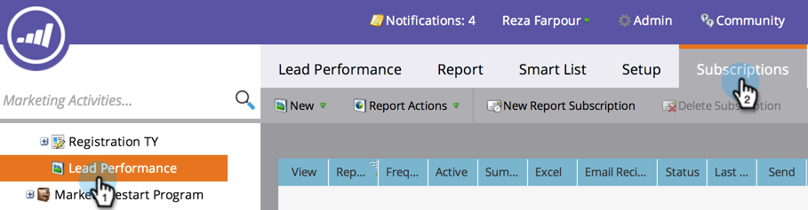

# 기본 보고서 구독 {#subscribe-to-a-basic-report}

기본 보고서의 자동 업데이트를 받거나 [공유](http://docs.marketo.com/display/docs/basic+reporting)시 기존 보고서에 이메일 주소를 가입하면 됩니다.

>[!NOTE]
>
>매출 [주기 탐색기](http://docs.marketo.com/display/docs/revenue+cycle+analytics) 보고서 구독 [의 경우 매출 탐색기 보고서 가입을 참조하십시오](../../../../product-docs/reporting/revenue-cycle-analytics/revenue-explorer/subscribe-to-a-revenue-explorer-report.md).

1. **마케팅 활동 **영역으로 이동합니다.

   

1. 탐색 트리에서 보고서를 선택하고 구독 **탭을 클릭합니다** .

   

   >[!NOTE]
   >
   >[ **분석] 탭에서 보고서에 가입할 수도** 있습니다.

1. 새 **보고서 구독을 클릭합니다**.

   

1. 이메일 주소를 입력하고 보고서 이메일의 빈도를 설정합니다.

   

   >[!NOTE]
   >
   >누구나 받은 이메일의 보고서 구독을 취소할 수 있습니다.

   바로 그거야! 받은 편지함 확인!

   

   >[!NOTE]
   >
   >**관련 문서**
   >
   >
   >모든 보고서 구독을 한 곳에서 [관리하는](manage-report-subscriptions.md) 방법을 알아봅니다.

   >[!NOTE]
   >
   >**딥 다이브**
   >
   >
   >자세한 내용은 [기본 보고](http://docs.marketo.com/display/docs/basic+reporting) 기능을 참조하십시오.

