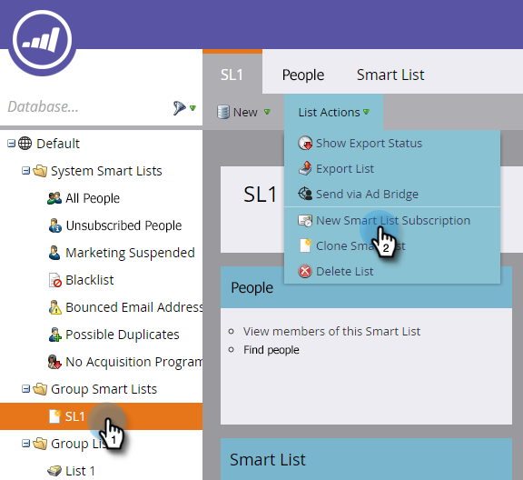
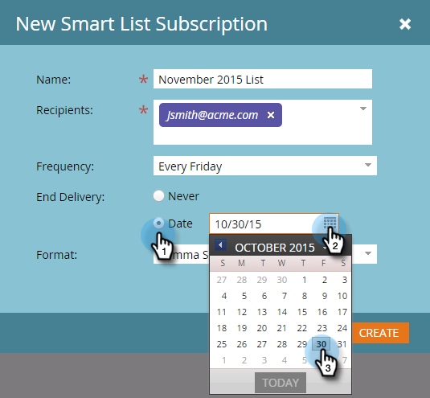

# 스마트 목록 구독 {#subscribe-to-a-smart-list}

스마트한 목록에 가입하면 받은 편지함으로 바로 보고서를 보내 사용자를 추적할 수 있습니다.

>[!NOTE]
>
>**FYI**
>
>Marketing은 이제 모든 구독 간의 언어를 표준화하므로 구독에 리드/리드 및 docs.markto.com에 있는 사람/사람을 볼 수 있습니다. 이 용어는 같은 것을 의미한다.아티클 지침에는 영향을 주지 않습니다. 다른 변화도 있습니다 [자세한](http://docs.marketo.com/display/DOCS/Updates+to+Marketo+Terminology)내용

두 개의 별도 위치에서 스마트 목록 구독을 만들 수 있습니다.

* 마케팅 활동
* 데이터베이스

구독은 구독이 실행되는 시점에 전체 사용자 목록을 사용합니다.

구독은 마케팅 활동 또는 데이터베이스에서 스마트 목록이 있는 곳에서 라이브됩니다.

동일한 스마트 목록에서 여러 개의 구독을 만들 수 있습니다.

구독은 작업 공간에 따라 다릅니다. 예를 들어 이 구독 목록은 이 문서의 나머지 부분에 나와 있는 작업 영역과 다른 작업 영역에 있습니다.

>[!NOTE]
>
>Adobe Marketing Cloud의 다양한 작업 영역 간에 구독은 100명, 구독당 최대 100,000명으로 제한됩니다. 스마트 목록에 10만 개 이상의 이름이 포함된 경우 처음 10만 개에 대한 구독이 실행됩니다.

## 스마트 목록 구독 만들기 {#create-a-smart-list-subscription}

1. 데이터베이스 **또는**&#x200B;마케팅 활동&#x200B;**으로**&#x200B;이동합니다.

   

1. 구독을 만들 스마트 목록을 선택합니다. 목록 작업 **을** 클릭하고** 새 스마트 목록 구독*을 선택합니다.

   

1. 사용료 지불 옵션에 **이름을**&#x200B;지정한 다음 **수신자**&#x200B;이메일 주소를 선택하거나 입력합니다.

   

1. 주파수 **목록을** 클릭하고 빈도를 선택합니다.

   ** 

   **

1. **배달 종료 **날짜를 설정합니다. 안 **함** 또는 달력 날짜를 선택할 수 있습니다.

   

1. 형식 **을** 클릭하고 목록에서 선택합니다.

   

1. 만들기를 **클릭합니다**.

   

1. 사용료 지불 옵션 탭의 목록 맨 위에 새로운 스마트 목록 구독이 나타납니다. 지금 **보내려면 [보내기** ]를 클릭하고 예약된 이메일 배달이 될 때까지 기다리지 마십시오.

   

1. 스마트 목록 구독을 구독하지 않은 경우 활성 확인란의 선택을 취소하는 것이 좋습니다.

   

   쉬웠죠?

## 이메일 메시지 {#email-message}

수신자는 보고서를 다운로드할 수 있는 옵션뿐만 아니라 Marketing To 인스턴스 내의 목록에 직접 연결된 링크가 포함된 이메일을 수신하게 됩니다. 다운로드 링크는 4일 후에 만료됩니다.

>[!NOTE]
>
>[ [보안 구독 관리](secure-the-subscription-admin-setting.md) ] 설정이 [예]로 **설정된**&#x200B;경우 Marketing인스턴스에 액세스할 수 있는 사용자만 보고서를 다운로드할 수 있습니다.

보고서에 직원이 0명인 경우 받는 사람은 여전히 이메일을 수신하게 됩니다. 그러나 이메일에는 보고할 사람이 없다고 간단히 나와 있습니다.

>[!NOTE]
>
>구독을 기반으로 하는 스마트 목록 필터를 수정하면 보고서도 업데이트됩니다.

또한 목록을 만드는 데 사용되는 필터에 대한 추가 정보도 이메일로 제공합니다.

## 구독 삭제 {#delete-a-subscription}

구독을 삭제하려면 구독 탭에서 선택한 후 구독 삭제를 클릭합니다.

>[!MORELIKETHIS]
>
>* [스마트 목록 구독 편집](edit-a-smart-list-subscription.md)
>* [구독 관리 설정 보호](secure-the-subscription-admin-setting.md)

>

