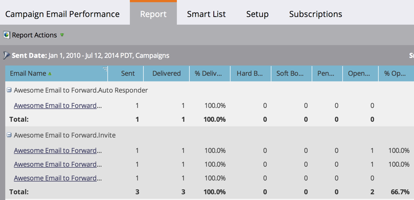

# 캠페인 이메일 성과 보고서 {#campaign-email-performance-report}

[스마트 캠페인](/help/marketo/product-docs/core-marketo-concepts/smart-campaigns/creating-a-smart-campaign/understanding-batch-and-trigger-smart-campaigns.md)별로 그룹화된 이메일 성과 통계를 보려면 캠페인 이메일 성과 보고서를 실행하십시오.

1. [보고서를 만들고](/help/marketo/product-docs/reporting/basic-reporting/creating-reports/create-a-report-in-a-program.md) **[!UICONTROL Campaign Email Performance]** [보고서 형식](/help/marketo/product-docs/reporting/basic-reporting/report-types/report-type-overview.md)을(를) 선택하십시오.

1. [보고서의 시간대를 설정](/help/marketo/product-docs/reporting/basic-reporting/editing-reports/change-a-report-time-frame.md)하고 **[!UICONTROL Report]** 탭을 클릭합니다.

1. 이제 보고서를 탐색하여 캠페인의 각 이메일이 어떻게 수행되었는지 확인하십시오.

   

   >[!TIP]
   >
   >이메일 이름을 클릭하여 이메일 미리 보기에서 엽니다.

   Campaign 이메일 성과 보고서에 대해 선택할 수 있는 [열](/help/marketo/product-docs/reporting/basic-reporting/editing-reports/select-report-columns.md)은(는) 다음과 같습니다.

   | 열 | 설명 |
   |---|---|
   | [!UICONTROL Hard Bounced] | 존재하지 않는 이메일 주소와 같은 영구 조건으로 인해 이메일이 거부되었습니다. |
   | [!UICONTROL Soft Bounced] | 서버가 다운되었거나 받은 편지함이 가득 차는 등의 일시적인 상태로 인해 이메일이 거부되었습니다. |
   | [!UICONTROL Pending] | 이메일이 아직 전달 중입니다. |
   | [!UICONTROL Clicked Link] | 이메일의 링크를 클릭한 이메일 수신자 수입니다. |
   | [!UICONTROL Unsubscribed] | 이메일의 **[!UICONTROL Unsubscribe]** 링크를 클릭하고 양식을 작성한 이메일 수신자 수입니다. |

   >[!NOTE]
   >
   >일반적으로 이러한 통계를 기록할 때는 상식을 이용합니다. 예를 들어, 누군가 이메일의 링크를 클릭한 경우 먼저 링크를 클릭한 것이 분명합니다. 따라야 할 특정 규칙을 보려면 [전자 메일 성능 보고서](/help/marketo/product-docs/email-marketing/email-programs/email-program-data/email-performance-report.md)를 참조하십시오.

   >[!MORELIKETHIS]
   >
   >* [캠페인 전자 메일 보고서에서 Assets 필터링](/help/marketo/product-docs/reporting/basic-reporting/report-activity/filter-assets-in-a-campaign-email-reports.md)
   >* [전자 메일 성능 보고서](/help/marketo/product-docs/email-marketing/email-programs/email-program-data/email-performance-report.md)
