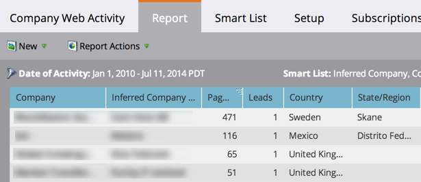

# 회사 웹 활동 보고서 {#company-web-activity-report}

웹 사이트를 방문하는 회사를 확인합니다. 알려진 방문자나 익명의 방문자를 표시하도록 선택할 수 있지만, 동일한 보고서에 둘 다 표시할 수는 없습니다.

만들기 [웹 페이지 활동 보고서](/help/marketo/product-docs/reporting/basic-reporting/report-types/web-page-activity-report.md) 를 클릭하여 사이트를 방문하는 개별 사용자를 확인합니다.

>[!PREREQUISITES]
>
>Marketo에서 웹 사이트에서 활동을 캡처하려면 먼저 설정해야 합니다 [사이트에서 Munchkin 업](/help/marketo/product-docs/administration/additional-integrations/add-munchkin-tracking-code-to-your-website.md).

1. [보고서 만들기](/help/marketo/product-docs/reporting/basic-reporting/creating-reports/create-a-report-in-a-program.md) 회사 웹 활동 보고서를 선택하고 선택합니다 [보고서 유형](report-type-overview.md).

1. 선택 [알려진 사람 또는 익명 사용자 표시](/help/marketo/product-docs/reporting/basic-reporting/report-activity/display-people-or-anonymous-visitors-in-web-reports.md) 참조하십시오.

1. [보고서 기간 설정](/help/marketo/product-docs/reporting/basic-reporting/editing-reports/change-a-report-time-frame.md) 을 클릭하고 **보고서** 탭.

1. 됐습니다. 보고서를 검토하여 사이트를 방문하는 회사를 확인하십시오.

   

   >[!TIP]
   >
   >사이트를 가장 많이 방문하는 회사를 찾으려면 [보고서 정렬](/help/marketo/product-docs/reporting/basic-reporting/editing-reports/sort-report-on-columns.md) on _페이지 보기 수_ 열 및 선택 **내림차순 정렬**.

   [선택할 수 있는 열](/help/marketo/product-docs/reporting/basic-reporting/editing-reports/select-report-columns.md) 회사 웹 활동 보고서에는 다음이 포함됩니다.

<table> 
 <thead> 
  <tr> 
   <th>열</th> 
   <th>설명</th> 
  </tr> 
 </thead> 
 <tbody> 
  <tr> 
   <td>회사</td> 
   <td>방문자 회사입니다.  <strong>굵은 이름</strong> 적어도 한 사람이 회사 이름으로 확인되었습니다.</td> 
  </tr> 
  <tr> 
   <td>유추 회사 또는 ISP</td> 
   <td>방문자의 IP 주소에서 유추된 회사입니다.   <strong>굵은 이름</strong> ISP가 아니라 회사임을 나타냅니다. </td> 
  </tr> 
  <tr> 
   <td>페이지 보기 수</td> 
   <td>방문자가 로드한 페이지 수입니다.</td> 
  </tr> 
  <tr> 
   <td>인물</td> 
   <td>사이트를 방문한 이 회사의 사용자 수입니다.</td> 
  </tr> 
  <tr> 
   <td>국가, 주/지역 및 도시</td> 
   <td>회사의 지리적 위치.</td> 
  </tr> 
  <tr> 
   <td>첫 번째/마지막 방문(시간대)</td> 
   <td>이 회사의 모든 사용자가 처음/마지막으로 방문한 날짜 및 시간입니다.</td> 
  </tr> 
 </tbody> 
</table>

>[!MORELIKETHIS]
>
>[웹 보고서에 사람 또는 익명 방문자 표시](/help/marketo/product-docs/reporting/basic-reporting/report-activity/display-people-or-anonymous-visitors-in-web-reports.md)
