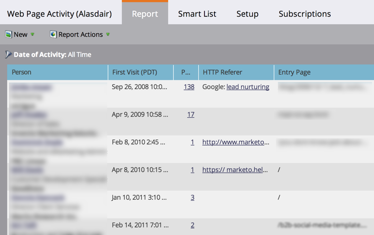

# 웹 페이지 활동 보고서 {#web-page-activity-report}

이 보고서에서는 웹 사이트를 방문하는 사용자가 누구인지 확인하고 이메일 버전의 보고서에 가입할 수 있습니다.

알려진 사람 또는 익명 사용자를 표시하도록 선택할 수 있지만 동일한 보고서에서 두 종류 모두 표시할 수는 없습니다.

>[!PREREQUISITES]
>
>* [웹 사이트에 Munchkin 추적 코드 추가](../../../../product-docs/administration/additional-integrations/add-munchkin-tracking-code-to-your-website.md)

1. [보고서를 ](../../../../product-docs/reporting/basic-reporting/creating-reports/create-a-report-in-a-program.md)만들고 웹 페이지 활동 보고서**  [보고서 유형을 선택합니다](report-type-overview.md).
1. 보고서에 [알려진 사람 또는 익명 사용자](../../../../product-docs/reporting/basic-reporting/report-activity/display-people-or-anonymous-visitors-in-web-reports.md)를 표시하도록 선택합니다.
1. [보고서의 시간대를 설정하고 ](../../../../product-docs/reporting/basic-reporting/editing-reports/change-a-report-time-frame.md) 보고서 탭을  **** 클릭합니다.
1. 됐다! 보고서를 검토하여 사이트를 방문하는 사람을 확인합니다.

   

   >[!NOTE]
   >
   >데이터가 웹 페이지 활동 보고서에 반영되는 데 최대 24시간이 걸릴 수 있습니다.

   >[!TIP]
   >
   >사이트를 가장 많이 방문하는 사용자를 확인하려면 페이지 보기&#x200B;*열에서 보고서를 정렬하고 내림차순 정렬을 선택합니다.*

   [Marketing To는 ](../../../../product-docs/reporting/basic-reporting/report-activity/tracking-anonymous-activity-and-people.md) 익명 웹 사이트 방문자를 데이터베이스에 추가하고 이 보고서에 표시하도록 선택할 수 있습니다. 익명이 아니어도 정보가 풍부하다.\
   [웹 페이지 활동 보고서](../../../../product-docs/reporting/basic-reporting/editing-reports/select-report-columns.md) 에 대해 선택할 수 있는 열은 다음과 같습니다.

<table> 
 <thead> 
  <tr> 
   <th>열</th> 
   <th>설명</th> 
  </tr> 
 </thead> 
 <tbody> 
  <tr> 
   <td>Person</td> 
   <td>방문자의 이름, 제목 및 회사입니다. <strong>개인 </strong> 세부 사항 및 활동 내역을 보려면 클릭합니다.</td> 
  </tr> 
  <tr> 
   <td>첫 번째/마지막 방문(시간대)</td> 
   <td>이 회사의 모든 사용자가 처음 또는 마지막으로 방문한 날짜 및 시간입니다.</td> 
  </tr> 
  <tr> 
   <td>페이지 보기 횟수</td> 
   <td>이 방문자가 로드한 페이지 수입니다. <strong></strong> 방문한 페이지를 보려면 클릭합니다.</td> 
  </tr> 
  <tr> 
   <td>HTTP Referer</td> 
   <td>방문자가 페이지로 이동하는 링크를 포함하는 페이지의 URL.</td> 
  </tr> 
  <tr> 
   <td>시작 페이지</td> 
   <td>방문자가 방문한 첫 페이지 </td> 
  </tr> 
  <tr> 
   <td>유추 회사 또는 ISP</td> 
   <td>방문자 IP 주소에서 유추된 회사입니다. <strong>ISP가 </strong> 아니라 회사입니다. </td> 
  </tr> 
  <tr> 
   <td>유추 국가, 주/지역 및 도시</td> 
   <td>IP 주소로부터 유추되는 방문자의 지리적 위치.</td> 
  </tr> 
 </tbody> 
</table>

>[!TIP]
>
>세일즈 직원들의 마음을 사로잡을 수 있습니다. [해당 영역에 ](../../../../product-docs/reporting/basic-reporting/editing-reports/filter-people-in-a-report-with-a-smart-list.md)대한 보고서를 필터링하고  [구독합니다](../../../../product-docs/reporting/basic-reporting/report-subscriptions/subscribe-to-a-basic-report.md)!

>[!NOTE]
>
>**관련 문서**
>
>* [본 웹 페이지, 웹 페이지 활동 보고서](web-page-activity-report/web-pages-viewed-web-page-activity-report.md)
>* [웹 보고서에 사람 또는 익명 방문자 표시](../../../../product-docs/reporting/basic-reporting/report-activity/display-people-or-anonymous-visitors-in-web-reports.md)

>[!NOTE]
>
>**자세히 알아보기**
>
>[기본 보고](http://docs.marketo.com/display/docs/basic+reporting)에서 다른 관심 있는 보고서에 대해 알아봅니다.
