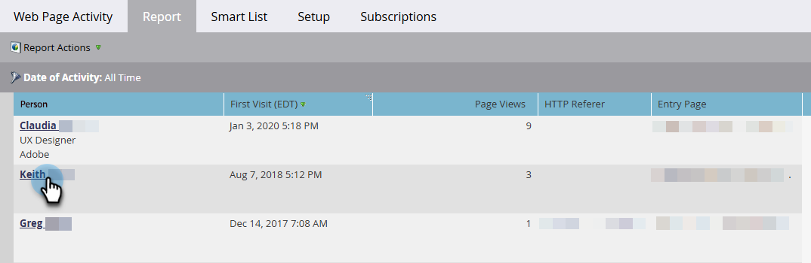

# 조회한 웹 페이지, 웹 페이지 활동 보고서 {#web-pages-viewed-web-page-activity-report}

[[!UICONTROL Web Page Activity] 보고서](/help/marketo/product-docs/reporting/basic-reporting/report-types/web-page-activity-report.md)에서 보고서의 사람들이 열람한 특정 페이지를 볼 수 있습니다.

>[!PREREQUISITES]
>
>Marketo의 웹 사이트에서 활동을 캡처하려면 먼저 [사이트에서 설정 [!DNL Munchkin] 해야](/help/marketo/product-docs/administration/additional-integrations/add-munchkin-tracking-code-to-your-website.md)합니다.

1. [웹 페이지 활동 보고서](/help/marketo/product-docs/reporting/basic-reporting/report-types/web-page-activity-report.md)에서 사용자 이름을 클릭합니다.

   

1. 사용자가 방문한 사이트의 페이지 목록과 날짜를 보여주는 새 탭이 열립니다.

   

   >[!MORELIKETHIS]
   >
   >[회사 웹 활동 보고서](/help/marketo/product-docs/reporting/basic-reporting/report-types/company-web-activity-report.md)를 만들어 사이트를 방문하는 회사를 확인하세요.
