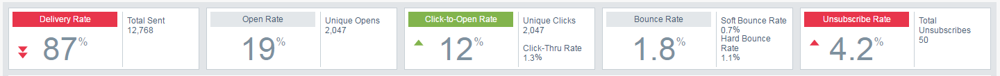
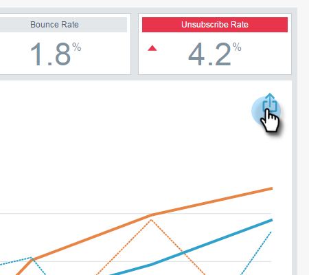

# 이메일 인사이트 분석 개요 {#email-insights-analytics-overview}

Analytics에서 이메일 전달 및 참여를 위한 집계 데이터를 탐색합니다. 왼쪽의 차트를 사용하여 데이터, 오른쪽의 인사이트를 탐색하여 보다 안내 가능한 경험을 만들 수 있습니다.

[필터](filtering-in-email-insights.md) 는 특정 지표에 대해 드릴다운하는 데 도움이 됩니다.

KPI(주요 관심 영역) 타일을 사용하면 보다 인기 있는 지표를 빠르게 확인할 수 있습니다.

KPI 타일 위로 마우스를 가져가면 자세한 내용이 표시됩니다...

`   
`

...또는 브라우저 창을 확장하여 마우스 커서를 가져가지 않고도 자세한 내용을 볼 수 있습니다(큰 화면에서).

&#39; 

&#39;

>[!TIP]
>
>그런 색깔들은 무슨 의미가 있어요! 녹색은 좋은 변화를 나타내고, 빨간색은 나쁜 변화를 의미하며, 회색은 아무것도 변하지 않았음을 의미합니다. 필터링에서 선택한 비교 기간을 기반으로 합니다.

차트에는 필터링된 기준이 표시됩니다. 필터 중 하나를 숨기려면 해당 색상 막대를 클릭하면 됩니다.

`   
`

...지표가 차트에서 사라집니다. 색상 막대를 다시 클릭하여 다시 표시합니다.

`   
`

다시 사용할 차트를 만드는 경우 [빠른 차트](email-insights-quick-charts.md)로 만드십시오.

`   
`

페이지 오른쪽의 안내 지표는 관련 드라이버를 찾는 데 도움이 됩니다. 페이지 왼쪽의 차트에서 보려면 지표를 클릭합니다.

>[!NOTE]
>
>오른쪽 상단에 새로 고침이 있습니까? 인사이트 모듈을 새로 고치려면 해당 아이콘을 수동으로 클릭해야 합니다. 현재 값을 무효화하는 필터를 변경한 경우에만 표시됩니다.

`  
You can also specify what you see (left to right): All, Audience, Content, and Platform.  
`  `   
`

>[!MORELIKETHIS]
>
>[이메일 인사이트 전송 개요](email-insights-sends-overview.md)

