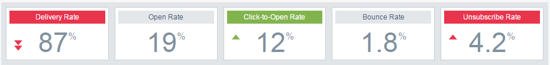

# 이메일 인사이트 분석 개요 {#email-insights-analytics-overview}

[!UICONTROL Analytics]에서 전자 메일 게재 및 참여를 위한 집계 데이터를 살펴보십시오. 왼쪽의 차트를 사용하여 데이터를 탐색하고, 오른쪽의 통찰력을 사용하여 보다 안내된 경험을 확인하십시오.

[필터링](/help/marketo/product-docs/reporting/email-insights/filtering-in-email-insights.md)을 통해 특정 지표를 드릴다운할 수 있습니다.

주요 관심 영역(KPI) 타일을 통해 더 인기 있는 지표를 빠르게 살펴볼 수 있습니다.

자세한 내용은 KPI 타일 위에 커서를 놓습니다...

...또는 브라우저 창을 (더 큰 화면에서) 확장하여 마우스 오버 없이 세부 정보를 볼 수 있습니다.

>[!TIP]
>
>그 색깔들은 의미가 있어요! 녹색은 좋은 변화를, 빨간색은 나쁜 변화를, 회색은 아무 것도 변하지 않았음을 의미한다. 필터링에서 선택한 비교 기간을 기반으로 합니다.

이 차트에는 필터링된 기준이 표시됩니다. 필터 중 하나를 숨기려면 해당 색상 막대를 클릭하면 됩니다.

...이고 지표가 차트에서 사라집니다. 색상 막대를 다시 클릭하여 다시 나타나게 합니다.

다시 사용할 차트를 만드는 경우 [빠른 차트](/help/marketo/product-docs/reporting/email-insights/email-insights-quick-charts.md)로 만드십시오.

페이지 오른쪽에서 안내가 있는 지표를 통해 관련 드라이버를 찾을 수 있습니다. 지표를 클릭하면 페이지 왼쪽에 있는 차트에서 볼 수 있습니다.

>[!NOTE]
>
>오른쪽 위에 있는 [!UICONTROL Refresh]을(를) 보았습니까? 이 정보가 표시되면 수동으로 클릭하여 Insights 모듈을 새로 고쳐야 합니다. 현재 값을 무효화하는 필터를 변경한 경우에만 표시됩니다.

표시되는 항목(왼쪽에서 오른쪽)을 모두, 대상, 콘텐츠 및 플랫폼으로 지정할 수도 있습니다.

>[!MORELIKETHIS]
>
>[이메일 인사이트 전송 개요](/help/marketo/product-docs/reporting/email-insights/email-insights-sends-overview.md)
