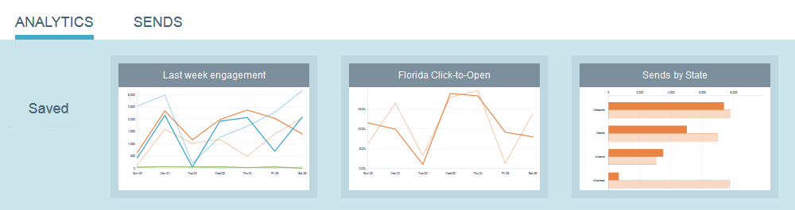

# 이메일 인사이트 개요 {#email-insights-overview}

이메일 통찰력은 이메일 마케터를 위한 내역 데이터를 통해 강력한 통찰력을 제공합니다. 두 개의 분리된 관련 섹션으로 구성됩니다.분석 및 전송.

이메일 인사이트에 액세스하려면 내 마케팅 또는 분석 홈 화면에서 해당 타일을 클릭하면 됩니다.   

>[!NOTE]
>
>기본적으로 액세스 권한이 있는 모든 작업 공간에 대한 데이터가 표시됩니다. 보지 않을 작업 영역을 선택 취소할 수 있습니다. 선택한 항목이 계속 기억됩니다.

## 분석 {#analytics}

Analytics [를](email-insights-analytics-overview.md) 사용하여 이메일 전달 및 참여 지표에 대한 전체 시계열 데이터를 탐색합니다.

**필터 **

고급 [필터를](filtering-in-email-insights.md) 사용하여 대상, 콘텐츠 또는 플랫폼별로 결과를 분류했습니다. 동일한 필터가 Analytics와 Sends 모두에 적용됩니다.

**빠른 차트**

[빠른 차트](email-insights-quick-charts.md) (Quick Charts)는 작성하고 저장한 축소판으로 중요한 차트를 빠르게 볼 수 있습니다.

## 전송 {#sends}

Sends [페이지에서](email-insights-sends-overview.md) 최근 이메일 커뮤니케이션의 특성을 검사합니다.

**지표**

지표 막대를 클릭하여 색상을 숫자로 변환합니다.

>[!NOTE]
>
>데이터가 이메일 인사이트에 반영되는 데 최대 8시간이 소요될 수 있습니다.

## 사용자 정의 Dimension {#custom-dimensions}

모든 표준 마케팅 차원이 포함되지만 최대 10개의 사용자 지정 차원을 추가할 수 있습니다. [사용자 지정 차원은](custom-dimensions-for-email-insights.md) 세그먼테이션 및 프로그램 태그로 구성됩니다.

>[!MORELIKETHIS]
>
>* [이메일 인사이트 분석 개요](email-insights-analytics-overview.md)
>* [이메일 인사이트를 통한 개요](email-insights-sends-overview.md)

>

