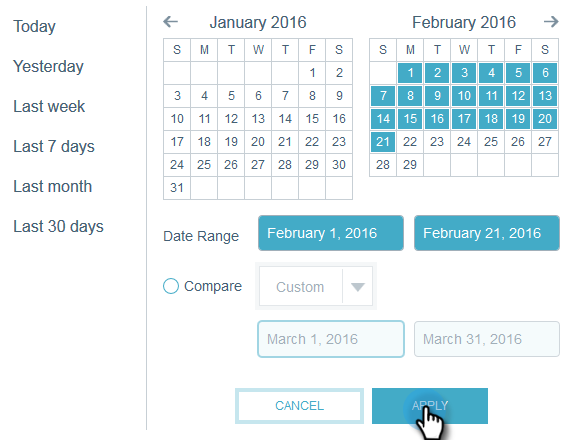

# 이메일 인사이트 빠른 차트 {#email-insights-quick-charts}

빠른 차트는 사용자가 가장 많이 사용하는 차트를 빠르게 볼 수 있도록 사용자 정의하고 저장하는 축소판입니다.

## 새 빠른 차트 {#create-a-new-quick-chart} 만들기

이 예에서는 2016년 2월 첫 3주 동안 캘리포니아주 및 플로리다 주에서 공개 비율을 선택합니다.

1. 분석 화면 오른쪽에 있는 날짜 필터를 클릭합니다.

   

1. 원하는 날짜 범위를 선택합니다.

   

1. 날짜 범위를 선택하면 **적용**&#x200B;을 클릭합니다.

   

1. 날짜가 적용된 후 차트가 변경됩니다.

   

1. 첫 번째 드롭다운을 클릭합니다. 기준을 클릭하여 선택(아직 선택되지 않은 경우)하고 원치 않는 기준을 선택 취소합니다.

   

1. 차트 오른쪽에서 내보내기 아이콘을 클릭하고 **빠른 차트로 저장**&#x200B;을 선택합니다.

   

1. 빠른 차트의 이름을 지정하고 **저장**&#x200B;을 클릭합니다.

   

   >[!NOTE]
   >
   >최대 20개의 빠른 차트를 사용할 수 있습니다. 삭제하여 교체할 수 있습니다.

1. 새 빠른 차트가 다른 차트와 함께 표시됩니다.

   

   바로 그거야!

   >[!TIP]
   >
   >빠른 차트를 이동하려면 간단히 클릭하여 원하는 위치로 드래그합니다.

## 빠른 차트 {#delete-a-quick-chart} 삭제

빠른 차트 중 하나를 삭제하시겠습니까? 쉬워!

1. **빠른 차트** 아이콘을 클릭합니다.

   

1. 원하는 차트 위로 마우스를 가져가면 클릭하지 않습니다. 마우스로 가리키면 X가 나타납니다. **X**&#x200B;을 클릭합니다.

   

1. **확인**&#x200B;을 클릭합니다.

   

   이제 빠른 차트가 삭제됩니다. 쉽다고 했잖아

