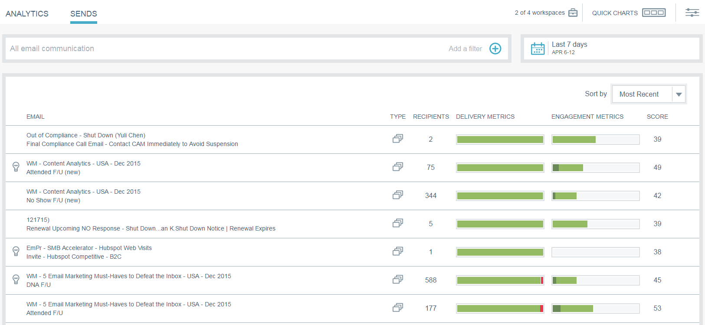

# 이메일 인사이트에서 개요 {#email-insights-sends-overview} 보내기

센드 페이지에서 최근 이메일 커뮤니케이션의 특성을 검사합니다.

[필터링](filtering-in-email-insights.md)을 사용하여 보려는 이메일을 지정합니다.

페이지 오른쪽에는 보낸 이메일에 대한 몇 가지 정보가 있습니다.

**유형** 은 사용된 자산의 종류를 나타냅니다.\
**Recipient** number는 이메일을 받은 사람의 수입니다.\
**배달** 지표를 통해 얼마나 많은 이메일이 배달되었거나, 보류 중이거나, 반송되었는지를 빠르게 볼 수 있습니다.\
**참여 지표** 를 사용하면 이메일에서 열어서, 클릭한 후 구독하지 않은 받는 사람 수를 빠르게 볼 수 있습니다.\
**점수** 는 이메일의  [참여 점수입니다](../../../product-docs/email-marketing/drip-nurturing/reports-and-notifications/understanding-the-engagement-score.md).

기본적으로 이메일은 가장 최근 이메일 기준으로 정렬되지만 사용 가능한 지표별로 정렬할 수 있습니다.

>[!NOTE]
>
>이메일은 프로그램 또는 캠페인 이름(위쪽) 및 이메일 자산 이름(아래쪽)으로 나열됩니다.

Analytics에서 이메일의 상태를 보려면 점수 옆에 마우스를 올려 놓고 차트 아이콘을 클릭합니다.   

멋진 물건이야!

>[!MORELIKETHIS]
>
>[이메일 인사이트 분석 개요](email-insights-analytics-overview.md)

