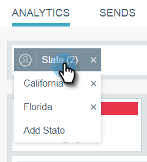
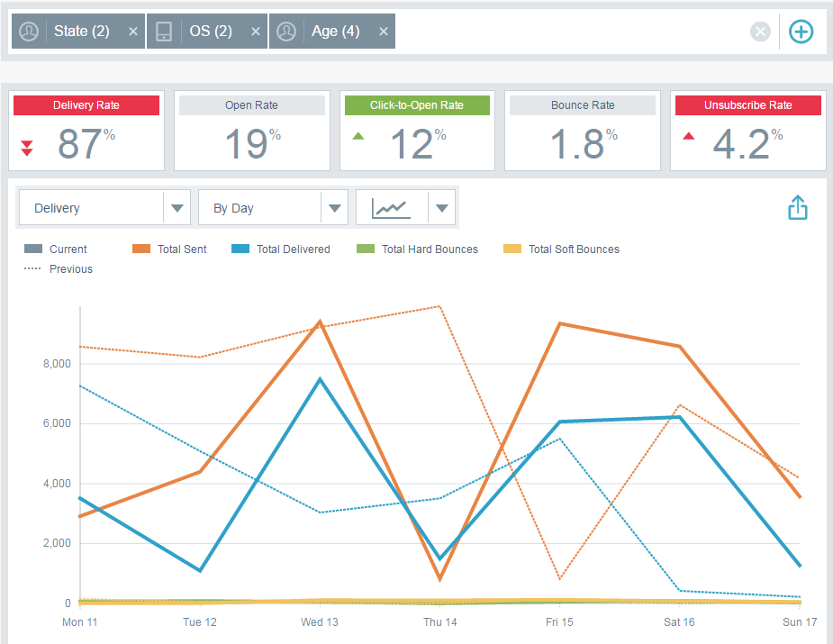

# 이메일 인사이트에서 필터링 {#filtering-in-email-insights}

이메일 인사이트에서는 데이터를 필터링하는 다양한 방법이 있습니다.

## 이메일 통찰력 {#email-insights}

필터 추가를 시작하려면 + 를 클릭합니다. 원하는 만큼 추가하세요.

동일한 카테고리에 필터가 두 개 이상 있는 경우 각각 병합되어 표시됩니다.

적용한 필터를 확인해야 하는 경우 필터를 클릭합니다. 더 추가할 수도 있습니다.

필터 유형을 추가할 수도 있습니다.

더 많은 필터!

각 필터가 적용된 후 차트가 변경됩니다.

카테고리를 삭제하려면 해당 X를 클릭합니다.

모든 필터를 지우려면 필터 표시줄의 끝에 있는 X를 클릭합니다.

날짜별 데이터의 경우 날짜 범위를 사용합니다.

일반적인 사전 설정 날짜 범위에서 선택하고, 특정 날짜를 선택하고, 비교를 위해 이전 기간을 사용하십시오.

>[!NOTE]
>
>날짜 범위는 Analytics 페이지와 전송 페이지 모두에 적용됩니다. 다음 **비교** 옵션은 Analytics 페이지에만 적용할 수 있습니다.

## 계정 기반 마케팅 {#account-based-marketing}

만약 [Target 계정 관리](https://docs.marketo.com/display/DOCS/Account+Based+Marketing+Overview)에는 특별히 적합한 필터가 있습니다.

