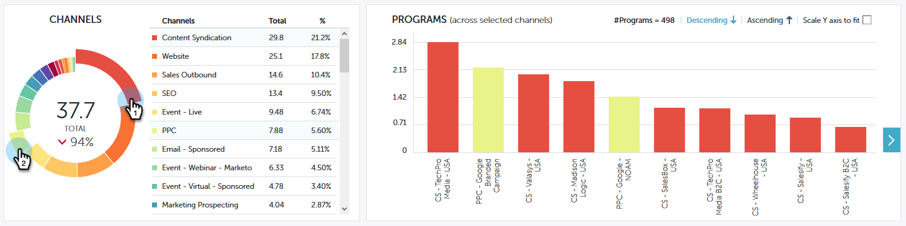

# 성과 통찰력 기여도 개요 {#performance-insights-contribution-overview}

Marketing to Performance Insights에서 기여도 보기가 기본적으로 표시됩니다.

성과를 볼 지표를 선택합니다. 이 예에서는 매출 대시보드에서 멀티터치를 통해 얻을 수 있는 기회를 살펴보겠습니다.

>[!NOTE]
>
>첫 [번째 터치 및 멀티 터치에 대해 학습합니다](http://docs.marketo.com/display/DOCS/Understanding+Attribution).

지표를 표시할 기간을 선택합니다. 이 예에서는 현재 연도(연간 누계)를 보고 있습니다.   

>[!NOTE]
>
>&quot;전년도&quot; 항목을 일시적으로 제거했습니다. 사용자 지정 범위 선택을 사용하여 이전 연도의 전체 성능 데이터를 보는 옵션이 여전히 있습니다.

지표는 다음 두 차트를 통해 제공됩니다.도넛과 막대.   

도넛형 차트는 선택한 지표에 대한 상위 10개 채널을 보여줍니다.

막대 차트는 선택한 지표에 대한 모든 채널(한 번에 10개 프로그램)의 프로그램 성과를 표시합니다. 자세한 내용을 보려면 오른쪽의 화살표를 클릭하여 다음 그룹으로 스크롤하십시오.

>[!TIP]
>
>그룹을 스크롤할 때 그래프의 막대가 확대되도록 하려면 Y축 **비율 조정 확인란을 선택합니다** .

막대 위에 마우스를 놓으면 자세한 내용을 볼 수 있습니다.   

도넛형 차트에서 하나 이상의 채널을 선택하면 해당 채널과 연관된 모든 프로그램이 오른쪽 막대 차트에 나타납니다. 채널을 다시 클릭하여 선택 취소합니다.

아래 데이터 격자는 선택한 속성 모델(첫 번째 터치/다중 터치)에서 사용 가능한 모든 지표를 보여주는 스프레드시트와 같이 작동합니다. 선택한 지표가 포함된 열이 강조 표시됩니다.

| **기회 획득** | 획득 기회에 영향을 주기 위해 프로그램에서 받은 크레딧의 부분(숫자 값) |
|---|---|
| **매출 원** | 원화절약에 영향을 주어 프로그램에서 받는 신용(금전적 가치) 부분 |
| **비용** | 프로그램의 총 비용 |
| **기회당 비용 원** | 프로그램의 비용 및 신용(숫자 값)의 비율(신규 기회 창출에 영향을 주기 위해 받은 프로그램 |
| **매출 원 대 원가 비율** | GCF가 받는 수익기회 및 사업비용에 영향을 미치는 신용(금전적 가치)의 비율 |

채널을 확장하면 상위 10개 프로그램이 표시되고 나머지 프로그램이 결합됩니다.

>[!NOTE]
>
>채널 옆의 확인란을 클릭하면 위의 도넛형 차트에서 활성화/비활성화할 수 있습니다.

