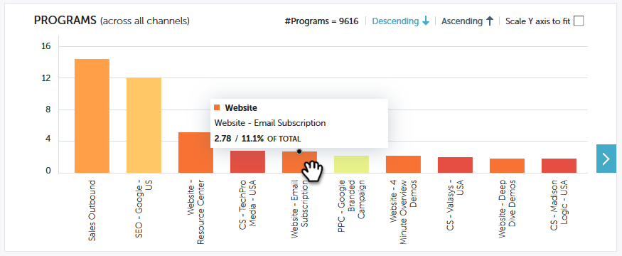

# 성능 통찰력 기여도 개요 {#performance-insights-contribution-overview}

Marketo 성능 인사이트에 기여도 보기가 기본적으로 표시됩니다.

성능을 확인할 지표를 선택합니다. 이 예에서는 매출 대시보드에서 멀티 터치를 통해 얻은 영업 기회를 살펴봅니다.

>[!NOTE]
>
>[첫 번째 접점 및 다중 접점](/help/marketo/product-docs/reporting/revenue-cycle-analytics/revenue-tools/attribution/understanding-attribution.md)에 대해 알아봅니다.

지표를 표시할 기간을 선택합니다. 이 예제에서는 올해(올해 초부터 현재까지)를 살펴봅니다.

>[!NOTE]
>
>&quot;이전 연도&quot; 선택 항목을 일시적으로 제거했습니다. 여전히 사용자 지정 범위 선택 항목을 사용하여 전체 전년도 성과 데이터를 볼 수 있습니다.

지표는 두 개의 차트(도넛과 막대)를 통해 표시됩니다.

도넛형 차트에는 선택한 지표에 대한 상위 10개 채널이 표시됩니다.

막대 차트는 선택한 지표에 대한 모든 채널(한 번에 10개의 프로그램)의 프로그램 성능을 표시합니다. 자세히 보려면 오른쪽의 화살표를 클릭하여 다음 그룹으로 스크롤합니다.

>[!TIP]
>
>그룹을 스크롤할 때 그래프의 막대를 확대하려면 **Y축을 크기에 맞게 조정** 확인란을 선택하십시오.

추가 세부 정보를 보려면 마우스를 막대 위로 가져갑니다.

도넛형 차트에서 하나 이상의 채널을 선택하면 해당 채널과 연결된 모든 프로그램이 오른쪽 막대형 차트에 나타납니다. 채널을 다시 클릭하여 선택을 해제합니다.

아래의 데이터 그리드는 선택한 속성 모델(첫 번째 터치/다중 터치)에서 사용 가능한 모든 지표를 보여 주는 스프레드시트와 같이 작동합니다. 선택한 지표가 포함된 열이 강조 표시됩니다.

| **성공한 기회** | 성공한 영업 기회에 영향을 미치기 위해 프로그램이 받은 크레딧(숫자 값) 비율 |
|---|---|
| **얻은 수익** | 프로그램이 Won 영업 기회에 영향을 미쳐 받은 크레딧(통화 가치 기준) 비율 |
| **비용** | 프로그램의 총 비용 |
| **성공한 기회당 비용** | 신규 기회 창출에 영향을 미쳐 프로그램이 받은 프로그램 비용 및 크레딧(숫자 값) 비율 |
| **비용 대비 수익** | 원화 기회에 영향을 미쳐 프로그램이 받은 크레딧 비중(금전적 가치)과 프로그램 비용의 비율 |

채널을 확장하여 상위 10개 프로그램을 확인하고 나머지 프로그램은 결합합니다.

>[!NOTE]
>
>채널 옆에 있는 확인란을 클릭하면 위의 도넛형 차트에서 활성화/비활성화됩니다.
