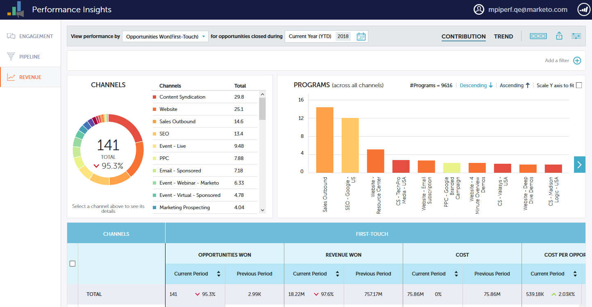

# 성능 통찰력 대시보드 {#performance-insights-dashboards}

MPI에서 사용 가능한 대시보드에 대해 자세히 알아보십시오.

## 참여 {#engagement}

관여 대시보드는 육성된 프로그램과 새 이름 획득 프로그램의 효과를 측정하는 데 도움이 됩니다.

대상자 참여 측정

교육 프로그램에서 대상 참여를 측정하려면 **성공** 지표를 선택합니다. 성공은 마케팅에서 의미 있는 상호 작용을 측정하는 것입니다.

프로그램의 목적은 개인 또는 잠재 고객과 의미 있는 상호 작용을 만드는 것입니다. 성공을 나타내는 것은 한 사람이 해당 목표를 이루는 상태에 도달하면 표시됩니다. 웨비나에 참석하거나, 이메일에 있는 링크를 클릭하거나, 웹 양식을 작성하는 것일 수 있습니다. 성공은 프로그램 채널에 따라 다릅니다.

>[!NOTE]
>
>**예**
>
>웨비나 프로그램에는 다음과 같은 여러 상태가 있을 수 있습니다.초대, 등록 및 참석. 사람들이 실제로 웨비나를 시청하지 않기 때문에 초대 또는 등록은 의미 있는 상호 작용이 아닙니다. 이 경우에는 참석한 것이 성공으로 간주된다.

새 이름 획득 측정

새 이름 획득 프로그램의 효과를 측정하려면 **새 이름** 지표를 선택합니다.

>[!NOTE]
>
>이 대시보드에서 최상의 결과를 얻으려면 획득 프로그램 및 리드 획득 날짜를 설정하려면 모든 프로그램을 설정해야 합니다.

## 파이프라인 {#pipeline}

파이프라인 대시보드에는 첫 번째 접촉 및 다중 터치 지표로 채널 성능이 표시됩니다.

<table> 
 <tbody> 
  <tr> 
   <td>
<strong>새로운 기회</strong>
</td> 
   <td>
새로운 기회 창출에 영향을 주어 프로그램에서 받은 크레딧의 부분. 관련된 리드가 여러 개 있는 경우 이는 매우 작은 것일 수 있습니다.
</td> 
  </tr> 
  <tr> 
   <td>
<strong>파이프라인 생성됨</strong>
</td> 
   <td>
기회 창출에 영향을 주어 프로그램에서 받은 신용(금전적 가치) 부분. 관련된 리드가 여러 개 있는 경우 합계의 일부일 수 있습니다.
</td> 
  </tr> 
  <tr> 
   <td>
<strong>열린 파이프라인</strong>
</td> 
   <td>
여전히 열려 있는 기회 창출에 영향을 주어 프로그램에서 받은 신용(금전적 가치) 부분. 관련된 리드가 여러 개 있는 경우 합계의 일부일 수 있습니다.
</td> 
  </tr> 
  <tr> 
   <td>
<strong>예상 매출</strong>
</td> 
   <td>
기회 창출에 영향을 주어 프로그램에서 받은 신용(금전적 가치) 부분. 예상 매출액은 기회 값을 곱한 기회 확률입니다. 관련된 리드가 여러 개 있는 경우 이는 매우 작은 것일 수 있습니다.
</td> 
  </tr> 
  <tr> 
   <td>
<strong>기회당 비용 생성</strong>
</td> 
   <td>
새로운 기회에 영향을 준 프로그램 비용의 일부를 새로 만든 총 기회 수로 나눈 값입니다.
</td> 
  </tr> 
  <tr> 
   <td>
<strong>비용 비율로 생성된 파이프라인</strong>
</td> 
   <td>
새로운 기회 창출에 영향을 주어 프로그램에서 받은 크레디트 부분은 기회 창출에 영향을 준 프로그램 비용의 일부로 나누어져 있습니다.
</td> 
  </tr> 
 </tbody> 
</table>

## 매출 {#revenue}

매출 대시보드에는 첫 번째 접촉 및 다중 터치 지표별로 채널 성능이 표시됩니다.

<table> 
 <tbody> 
  <tr> 
   <td>
<strong>기회 획득</strong>
</td> 
   <td>
한 프로그램에서 원화 기회에 영향을 주어 받는 신용 부분.
</td> 
  </tr> 
  <tr> 
   <td>
<strong>매출 원</strong>
</td> 
   <td>
원화 기회에 영향을 주어 받는 신용(통화 가치)의 부분.
</td> 
  </tr> 
  <tr> 
   <td>
<strong>기회당 비용 원</strong>
</td> 
   <td>
새로운 기회에 영향을 준 프로그램 비용의 일부를 새로 만든 총 기회 수로 나눈 값입니다.
</td> 
  </tr> 
  <tr> 
   <td>
<strong>매출 원 대 비용 비율</strong>
</td> 
   <td>
원화 기회에 영향을 주어 신용(통화 가치)의 일부를 새로운 기회에 영향을 준 프로그램 비용의 일부로 나눈 값입니다.
</td> 
  </tr> 
 </tbody> 
</table>

