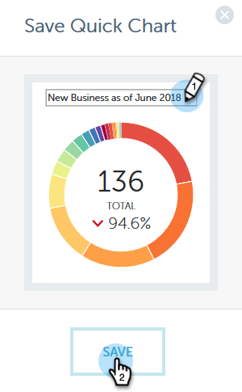

# 성과 통찰력 빠른 차트 {#performance-insights-quick-charts}

빠른 차트는 사용자가 가장 많이 사용하는 차트를 빠르게 볼 수 있도록 사용자 정의 및 저장하는 축소판입니다.

## 새 빠른 차트 만들기 {#create-a-new-quick-chart}

빠른 차트는 지정한 데이터에서 파생됩니다. 이 예에서는 다음을 선택합니다. **새로운 기회(첫 번째 접촉), 기회 유형 = 신규 사업, 현재 연간 누계**.

1. 날짜 필터를 클릭하고 **현재 연도(YTD)를 선택합니다**.

   

1. 을 **+** 클릭하고 기준을 선택합니다.

   

1. 선택한 필터를 반영하도록 차트가 업데이트됩니다.

   

1. 내보내기 아이콘을 클릭하고 빠른 차트로 **저장을 선택합니다**.

   

1. 빠른 차트의 이름을 지정하고 저장을 **클릭합니다**.

   

이제 빠른 차트가 다른 차트와 함께 제공됩니다.

>[!NOTE]
>
>최대 20개의 빠른 차트를 사용할 수 있습니다. 삭제하여 교체할 수 있습니다.

## 기존 빠른 차트 보기 {#view-existing-quick-charts}

1. 기존 빠른 차트를 보려면 **빠른 차트** 아이콘을 클릭하면 됩니다.

   

## 빠른 차트 삭제 {#delete-a-quick-chart}

빠른 차트를 삭제해야 하는 경우 다음 간단한 단계를 따르십시오.

1. 빠른 차트 **아이콘을** 클릭합니다.

   

1. 원하는 차트 위로 마우스를 가져가면 클릭하지 않습니다. 마우스를 가져가면 X가 나타납니다. X를 **클릭합니다**.

   

1. 삭제를 **클릭합니다**.

   

