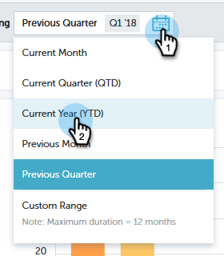

# 성능 통찰력 빠른 차트 {#performance-insights-quick-charts}

빠른 차트 는 사용자 정의하고 저장하는 축소판으로서 가장 많이 사용하는 차트를 빠르게 볼 수 있습니다.

## 새 빠른 차트 만들기 {#create-a-new-quick-chart}

빠른 차트는 사용자가 지정하는 데이터에서 가져옵니다. 이 예제에서는 **새 영업 기회(첫 번째 터치), 영업 기회 유형 = 새 비즈니스, 올해 초부터 현재까지**&#x200B;를 선택합니다.

1. 날짜 필터를 클릭하고 **현재 연도(YTD)**&#x200B;를 선택합니다.

   

1. **+**&#x200B;을(를) 클릭하고 조건을 선택합니다.

   

1. 선택한 필터를 반영하도록 차트가 업데이트됩니다.

   

1. 내보내기 아이콘을 클릭하고 **빠른 차트로 저장**&#x200B;을 선택합니다.

   

1. 빠른 차트 이름을 지정하고 **저장**&#x200B;을 클릭하세요.

   

빠른 차트가 다른 사용자와 함께 제공됩니다.

>[!NOTE]
>
>최대 20개의 빠른 차트를 보유할 수 있습니다. 지우고 바꿀 수 있습니다.

## 기존 빠른 차트 보기 {#view-existing-quick-charts}

1. 기존 빠른 차트를 보려면 **빠른 차트** 아이콘을 클릭하면 됩니다.

   

## 빠른 차트 삭제 {#delete-a-quick-chart}

빠른 차트를 삭제해야 하는 경우 다음 간단한 단계를 수행합니다.

1. **빠른 차트** 아이콘을 클릭합니다.

   

1. 원하는 차트 위로 마우스를 가져간 후 클릭하지 마십시오. 마우스를 가져가면 X가 표시됩니다. **X**&#x200B;을(를) 클릭합니다.

   

1. **삭제**&#x200B;를 클릭합니다.

   
