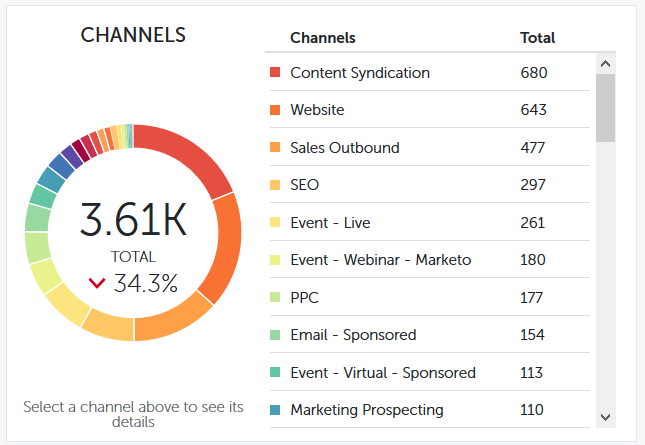
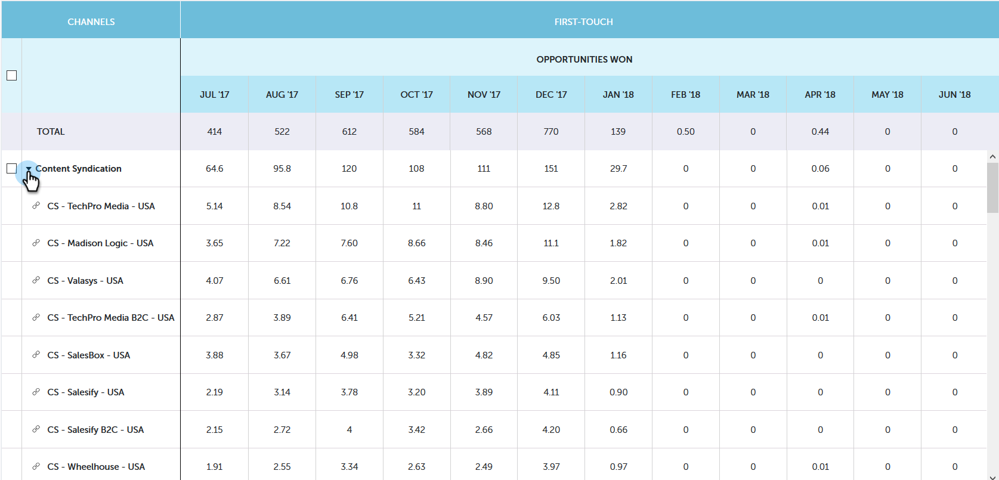

# [!UICONTROL Performance Insights] 트렌드 개요 {#performance-insights-trend-overview}

[!UICONTROL Trend]이(가) 일정 기간 동안의 채널 성능을 표시합니다.

이 보기에 액세스하려면 **[!UICONTROL Trend]** 탭을 클릭하십시오.

## [!UICONTROL Trend] {#trend}

성능을 확인할 지표를 선택합니다.

지표는 두 개의 차트(도넛과 라인)를 통해 표시됩니다.

도넛형 차트에는 선택한 지표에 대한 상위 10개 채널이 표시됩니다.

라인 차트에는 지난 12개월 동안 선택한 지표에 대한 채널 성능 트렌드가 표시됩니다.

하나 이상의 채널을 선택하면 꺾은선형 차트에 채널 트렌드가 표시됩니다. 채널을 다시 클릭하여 선택을 해제합니다.

아래의 데이터 그리드는 스프레드시트처럼 작동하여 지난 12개월 동안 선택한 지표에 대해 사용 가능한 모든 트렌드 데이터를 표시합니다.

채널을 확장하여 상위 10개 프로그램을 확인하고 나머지 프로그램은 결합합니다.

>[!NOTE]
>
>채널 옆에 있는 확인란을 클릭하면 도넛형 차트에서 활성화/비활성화됩니다.
