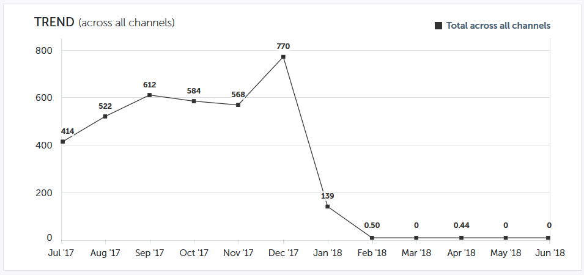

# 성과 통찰력 트렌드 개요 {#performance-insights-trend-overview}

트렌드는 일정 기간 동안의 채널 성과를 보여줍니다.

이 보기에 액세스하려면 **트렌드** 탭을 클릭합니다.

## 트렌드 {#trend}

성과를 볼 지표를 선택합니다. 이 예에서는 [첫 번째 터치를 통해 얻은 기회를 살펴보겠습니다](http://docs.marketo.com/display/DOCS/Understanding+Attribution).

지표는 다음 두 차트를 통해 제공됩니다.도넛과 줄

도넛형 차트는 선택한 지표에 대한 상위 10개 채널을 보여줍니다.

라인 차트에는 지난 12개월 동안 선택한 지표에 대한 채널 성과 트렌드가 표시됩니다.

하나 이상의 채널을 선택하면 라인 차트에 채널 트렌드가 표시됩니다. 채널을 다시 클릭하여 선택 취소합니다.

아래 데이터 그리드는 스프레드시트와 같이 작동하며 지난 12개월 동안 선택한 지표에 대해 사용 가능한 모든 트렌드 데이터를 표시합니다.

채널을 확장하면 상위 10개 프로그램이 표시되고 나머지 프로그램이 결합됩니다.

>[!NOTE]
>
>채널 옆의 확인란을 클릭하면 도넛형 차트에서 활성화/비활성화할 수 있습니다.

