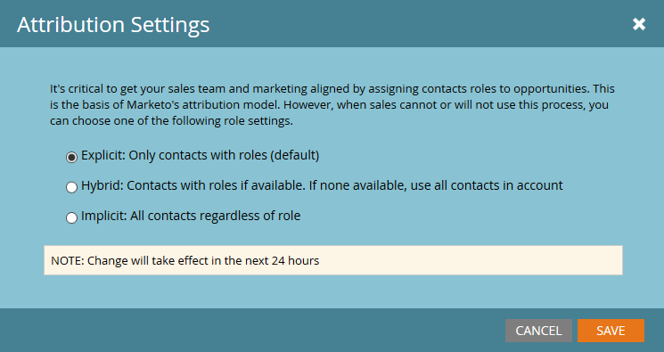
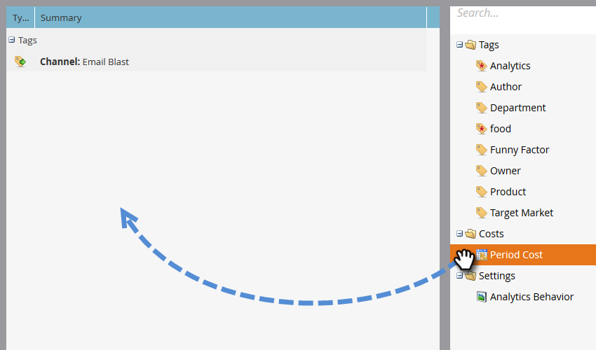

# 성과 인사이트 설정 {#setting-up-performance-insights}

MPI를 설정하려면 아래 단계를 따르십시오.

## 기회 설정 {#opportunity-setup}

1. **관리**&#x200B;를 클릭합니다.

   

1. **매출 주기 분석**&#x200B;을 클릭합니다.

   

   >[!NOTE]
   >
   >RCA가 없는 경우 2단계에서 **프로그램 분석**&#x200B;을 선택해야 합니다.

1. 속성 아래에서 **편집**&#x200B;을 클릭합니다.

   

1. 속성 설정이 표시됩니다.

   

   속성이 명시적으로 표시되는 경우 기회 역할 끝점을 통해 또는 CRM 통합을 통해 기회 연락처 역할이 채워졌는지 확인합니다.

   속성이 암시적이면 리드/연락처의 회사 필드가 기회의 계정 이름과 동일한지 확인합니다.

   >[!NOTE]
   >
   >모든 기회에 적절한 필드가 채워졌는지 확인합니다.
   >
   >    
   >    
   >    * 기회 금액
   >    * 닫혀 있음
   >    * 원
   >    * 작성 날짜(이 경우 설정할 수 없음)
   >    * 마감 날짜(이 경우 설정되지 않을 수 있음)
   >    * 기회 유형

## 프로그램 설정 {#program-setup}

프로그램 비용을 최소 12개월 동안 업데이트합니다. 수동으로 또는 프로그램 API를 사용하여 이 작업을 수행할 수 있습니다. 이 예에서는 수동으로 수행합니다.

1. **마케팅 활동**&#x200B;을 클릭합니다.

   

1. 프로그램을 찾아 선택합니다.

   

1. **설정** 탭을 클릭합니다.

   

1. **기간 비용**&#x200B;을 캔버스로 드래그합니다.

   

1. 최소 12개월 전에 프로그램 월을 설정하고 **확인**&#x200B;을 클릭합니다.

   

1. 기간 비용을 설정하고 **저장**&#x200B;을 클릭합니다.

   

그런 다음 분석 행동을 검토하여 특정 채널을 분석에 포함해야 하는지 여부를 지정합니다. 분석 동작(표준, 포함, 작동)을 설정합니다.

1. **관리**&#x200B;를 클릭합니다.

   

1. **태그**&#x200B;를 클릭합니다.

   

1. **+**&#x200B;을 클릭하여 채널 목록을 확장합니다.

   

1. 원하는 채널을 두 번 클릭합니다.

   

1. **분석 동작** 드롭다운을 클릭하고 원하는 동작을 선택합니다.

   

1. 성공 기준을 설정합니다.

   

1. **저장**&#x200B;을 클릭합니다.

   

## 프로그램을 {#tie-the-program-to-the-person} 사람에 연결

1. 첫 번째 터치 속성이 작동되도록 데이터베이스의 각 사용자에 대해 획득 프로그램 및 획득 날짜가 설정되어 있는지 확인합니다.
1. 프로그램이 국민을 위한 성공 상태를 설정하도록 합니다.

>[!NOTE]
>
>변경 사항은 즉시 표시되지 않습니다. 변경이 효력을 발휘하기 전에 1일 근무기간이 필요하다.

