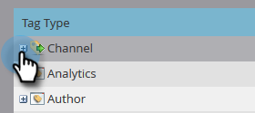

# 성능 통찰력 설정 {#setting-up-performance-insights}

아래 단계에 따라 MPI를 설정합니다.

## 기회 설정 {#opportunity-setup}

1. 클릭 **관리**.

   

1. 클릭 **Revenue Cycle Analytics**.

   

   >[!NOTE]
   >
   >RCA가 없는 경우 다음을 선택해야 합니다 **프로그램 분석** 을 참조하십시오.

1. 속성에서 **편집**.

   

1. 속성 설정이 표시됩니다.

   

   Attribution이 명시적이면 Opportunity Role 종단점 또는 CRM 통합을 통해 Opportunity Contact Role 이 채워졌는지 확인합니다.

   속성이 암시적이면 리드/연락처의 회사 필드가 기회의 계정 이름과 같은지 확인합니다.

   >[!NOTE]
   >
   >모든 기회에 적절한 필드가 채워져 있는지 확인합니다.
   >
   >* 기회 금액
   >* 닫혀 있음
   >* 원
   >* 생성 날짜(이 경우에는 설정되지 않을 수 있음)
   >* 마감일(이 경우에는 설정되지 않을 수 있음)
   >* 영업 기회 유형

## 프로그램 설정 {#program-setup}

프로그램 비용을 최소 12개월 동안 업데이트합니다. 이를 수동으로 또는 프로그램 API를 사용하여 수행할 수 있습니다. 이 예제에서는 수동으로 수행합니다.

1. 클릭 **마케팅 활동**.

   

1. 프로그램을 찾아 선택합니다.

   

1. 을(를) 클릭합니다. **설정** 탭.

   

1. 드래그 **기간 원가** 캔버스에

   

1. 최소 12개월 전에 프로그램 월을 설정하고 을 클릭합니다. **확인**.

   

1. 기간 원가를 설정하고 을 클릭합니다. **저장**.

   

다음으로, 분석 동작을 검토하여 특정 채널을 analytics에 포함해야 하는지 여부를 지정합니다. Analytics 동작(일반, 포함, 작동)을 설정합니다.

1. 클릭 **관리**.

   

1. 클릭 **태그**.

   

1. 을(를) 클릭합니다. **+** 를 클릭하여 채널 목록을 확장합니다.

   

1. 원하는 채널을 두 번 클릭합니다.

   

1. 을(를) 클릭합니다. **Analytics 동작** 드롭다운을 클릭하고 원하는 동작을 선택합니다.

   

1. 성공 기준을 설정합니다.

   

1. 클릭 **저장**.

   

## 프로그램에 개인 연결 {#tie-the-program-to-the-person}

1. 첫 번째 터치 속성이 작동하려면 데이터베이스의 각 사용자에 대해 획득 프로그램 및 획득 날짜가 설정되었는지 확인하십시오.
1. 프로그램이 사용자의 성공 상태를 설정하는지 확인합니다.

>[!NOTE]
>
>변경 사항은 즉시 표시되지 않습니다. 변경이 시행되기 전에 하룻밤 시간이 필요하다.
