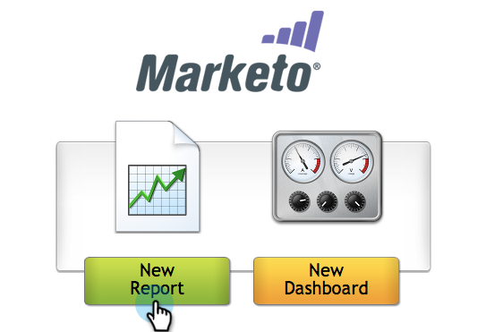

# 리드가 {#build-an-email-analysis-report-that-lists-leads}인 이메일 분석 보고서 작성

>[!AVAILABILITY]
>
>
>모든 고객이 이 기능을 구입하지는 않았습니다. 자세한 내용은 영업 담당자에게 문의하십시오.

다음 단계에 따라 특정 이메일을 보낸 모든 리드를 보여주는 이메일 분석 보고서를 만듭니다. 이 보고서에는 클릭 및 열기 상태도 포함됩니다. 1. 매출 탐색기를 시작합니다.

1. 새 보고서를 클릭합니다.

   

1. 이메일 분석 영역을 선택하고 확인을 클릭합니다.

   

1. 이메일 이름 노란색 점을 찾아 마우스 오른쪽 버튼으로 클릭한 다음 필터를 선택합니다.

   

1. 목록에서 원하는 이메일을 두 번 클릭하고 확인을 클릭합니다.

   

1. 이메일 이름 노란색 점을 열로 드래그합니다.

   

   >[!TIP]
   >
   >열로 추가할 수 있는 리드/회사 속성이 많이 있으며 확인하고 확인할 수 있습니다.

1. 전체 이름 노란색 점을 찾아 행으로 드래그합니다.

   

1. 이제 두 번 클릭하여 관심 있는 측정값을 추가합니다.

   

>[!NOTE]
>
>이 보고서가 있는 데이터의 양에 따라 새로 고치는 데 시간이 걸릴 수 있습니다.

이제 보고서를 마쳤으면 다음과 같이 표시됩니다.   

임무 완료!
