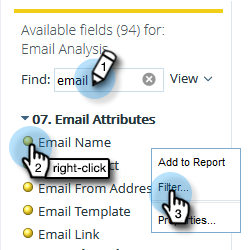

# 리드를 나열하는 이메일 분석 보고서 작성 {#build-an-email-analysis-report-that-lists-leads}

>[!AVAILABILITY]
>
>모든 고객이 이 기능을 구입한 것은 아닙니다. 자세한 내용은 고객 성공 관리자에게 문의하십시오.

다음 단계에 따라 특정 전자 메일을 보낸 모든 리드를 보여 주는 이메일 분석 보고서를 만듭니다. 이 보고서에는 클릭 및 열기 상태도 포함됩니다.

>[!NOTE]
>
>이메일 분석 RCA를 지원하는 데이터 엔진은 동일한 이메일 및 캠페인에서 나온 경우 1인당 12클릭보다 큰 클릭 수를 무시합니다. 이메일 분석 보고서를 표준 Marketo Analytics 보고와 비교할 때 이를 고려하십시오.

1. Launch **매출 탐색기**.

   

1. 클릭 **새로 만들기** 그런 다음 **보고서**.

   

1. 이메일 분석 을 선택하고 을(를) 클릭합니다 **확인**.

   

1. 이메일 이름 노란색 점을 찾아 마우스 오른쪽 단추로 클릭한 다음 을 선택합니다 **필터**.

   

1. 목록에서 선택한 이메일을 두 번 클릭하고 **확인**.

   

1. 을(를) 드래그합니다. **이메일 이름** 노란색 점 **열**.

   

   >[!TIP]
   >
   >열로 추가하고, 확인할 수 있는 많은 리드/회사 특성이 있습니다.

1. 를 찾습니다. **전체 이름** 노란색 점 및 끌어서 **행**.

   

1. 이제 를 추가합니다. **측정 단위** 두 번 클릭하시면 됩니다.

   

>[!NOTE]
>
>보유한 데이터의 양에 따라 이 보고서를 새로 고치는 데 시간이 걸릴 수 있습니다.

임무 완료!
