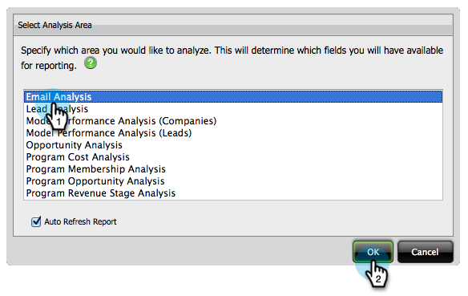

# 프로그램 정보 {#build-an-email-analysis-report-that-shows-program-information}를 표시하는 이메일 분석 보고서 만들기

다음 단계에 따라 프로그램 채널별로 그룹화된 이메일 정보를 표시하는 이메일 분석 보고서를 만듭니다.

>[!AVAILABILITY]
>
>
>모든 고객이 이 기능을 구입하지는 않았습니다. 자세한 내용은 영업 담당자에게 문의하십시오.

1. **매출 탐색기**&#x200B;를 시작합니다.

   

1. **새 보고서**&#x200B;를 클릭합니다.

   

1. 이메일 분석** 영역을 선택하고 **확인**&#x200B;을 클릭합니다.

   

1. **전송(주)** 노란색 점을 찾아 마우스 오른쪽 단추로 클릭합니다. **필터**&#x200B;를 클릭합니다.

   >[!NOTE]
   >
   >이렇게 하면 보고서의 시간대가 좁아질 것이다.

   

1. **현재 보낸 주**&#x200B;를 선택하고 **확인**&#x200B;을 클릭합니다.

   

1. 프로그램 채널** 노란색 점을 찾아 두 번 클릭합니다.

   

1. **이메일 이름** 노란색 점을 찾아 두 번 클릭합니다.

   

1. **Sent**, **Opened** 및 **클릭한** 파란색 점을 찾아 두 번 클릭합니다.

   

   잘했어요! 다음과 같은 보고서가 있어야 합니다.

   

   >[!NOTE]
   >
   >**자세히 알아보기**
   >
   >
   >[매출 주기 탐색기](http://docs.marketo.com/display/docs/revenue+cycle+analytics)에 대해 자세히 알고 싶으십니까?

