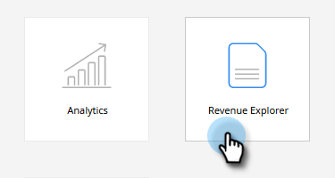
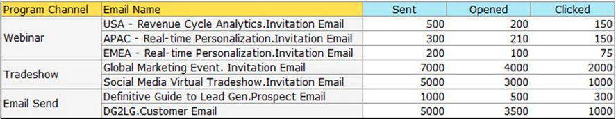

# 프로그램 정보를 표시하는 이메일 분석 보고서 작성 {#build-an-email-analysis-report-that-shows-program-information}

다음 단계에 따라 프로그램 채널별로 그룹화된 이메일 정보를 표시하는 이메일 분석 보고서를 만듭니다.

>[!AVAILABILITY]
>
>모든 사용자가 이 기능을 구입한 것은 아닙니다. 자세한 내용은 Adobe 계정 팀(계정 관리자)에 문의하십시오.

1. **매출 탐색기**&#x200B;를 시작합니다.

   

1. **새로 만들기**&#x200B;를 클릭하고 **보고서**&#x200B;를 선택합니다.

   

1. **전자 메일 분석** 영역을 선택하고 **확인**&#x200B;을 클릭합니다.

   

1. **보낸(주)** 노란색 점을 찾아 마우스 오른쪽 단추로 클릭합니다. **필터**&#x200B;를 클릭합니다.

   >[!NOTE]
   >
   >이렇게 하면 보고서의 기간이 좁아지게 됩니다.

   

1. **현재 보낸 주**&#x200B;를 확인하고 **확인**&#x200B;을 클릭합니다.

   

1. **프로그램 채널** 노란색 점을 찾아 두 번 클릭합니다.

   

1. **전자 메일 이름** 노란색 점을 찾아 두 번 클릭합니다.

   

1. **전송됨**, **열림** 및 **클릭됨** 파란색 점을 찾아 두 번 클릭합니다.

   

   좋습니다! 다음과 유사한 보고서가 있어야 합니다.

   
