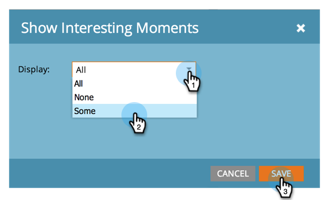

# 기회 영향 분석기 {#configure-an-opportunity-influence-analyzer} 구성

[기회 영향 분석기](create-an-opportunity-influence-analyzer.md)를 만든 후 포함된 [관심 항목](/help/marketo/product-docs/marketo-sales-insight/msi-for-salesforce/features/tabs-in-the-msi-panel/interesting-moments/interesting-moments-overview.md)의 유형을 구성할 수 있습니다.

>[!PREREQUISITES]
>
>* [기회 영향 분석기 만들기](create-an-opportunity-influence-analyzer.md)

1. 분석을 클릭합니다.

   

1. Analytics로 이동하여 Opportunity Impact Analyzer를 선택합니다.

   

   분석기 그래프에 흥미로운 부분이 너무 많으면 **설정** 패널에서 사람을 선택 취소하거나 관심 있는 순간에 대한 유형을 줄여 줄일 수 있습니다.

1. 포함할 관심 항목 유형을 구성하려면 설정 탭으로 이동하여 관심 항목 필터에서 드래그합니다.

   

1. 모두, 없음 또는 일부 중 중 어떤 것을 표시할지 선택합니다.

   

1. [일부]를 선택하면 포함할 유형을 선택할 수 있습니다.

   

1. 원하는 각 유형의 흥미로운 순간을 클릭합니다. 그런 다음 저장을 클릭합니다.
1. 선택한 관심 항목 유형만 포함하여 기회의 내역을 보려면 기본 탭을 클릭합니다.

   

>[!NOTE]
>
>다른 분석기는 [기본 보고](http://docs.marketo.com/display/docs/basic+reporting)를 참조하십시오.

>[!MORELIKETHIS]
>
>* [기회 영향 분석기를 사용하여 마케팅 스토리 전달](tell-the-marketing-story-with-an-opportunity-influence-analyzer.md)

