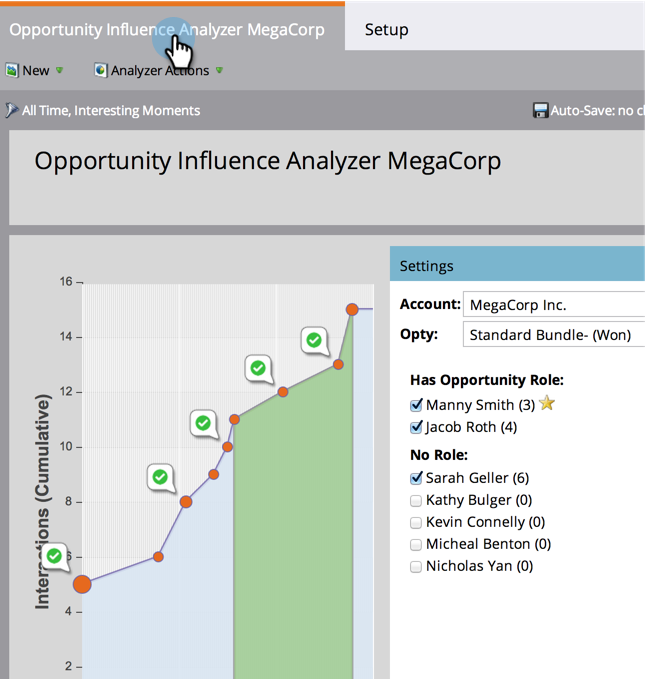

# 기회 영향 분석기 구성 {#configure-an-opportunity-influence-analyzer}

기회 영향 분석기를 [만들면](create-an-opportunity-influence-analyzer.md)포함된 [관심](/help/marketo/product-docs/marketo-sales-insight/msi-for-salesforce/features/tabs-in-the-msi-panel/interesting-moments/interesting-moments-overview.md) 순간의 유형을 구성할 수 있습니다.

>[!NOTE]
>
>**사전 요구 사항**
>
>* [기회 영향 분석기 만들기](create-an-opportunity-influence-analyzer.md)

1. 분석을 클릭합니다.

   

1. Analytics로 이동하여 Opportunity Affect Analyzer를 선택합니다.

   

   Analyzer 그래프에 흥미로운 부분이 너무 많을 경우 **설정** 패널에서 사람을 선택하거나 관심 분야의 유형을 줄여 줄일 수 있습니다.

1. 포함할 관심 항목 유형을 구성하려면 설정 탭으로 이동하여 관심 있는 순간 필터에서 드래그합니다.

   

1. 모두, 없음 또는 일부를 표시할지 여부를 선택합니다.

   

1. [일부]를 선택하면 포함할 유형을 선택할 수 있습니다.

   

1. 원하는 각 유형의 흥미로운 순간을 클릭합니다. 그런 다음 저장을 클릭합니다.
1. 주요 탭을 클릭하면 선택한 관심 항목 유형만 포함된 기회 내역이 표시됩니다.

   

>[!NOTE]
>
>다른 분석기를 보려면 [기본 보고를 참조하십시오](http://docs.marketo.com/display/docs/basic+reporting).

>[!MORELIKETHIS]
>
>* [기회 영향 분석기를 사용하여 마케팅 스토리 전달](tell-the-marketing-story-with-an-opportunity-influence-analyzer.md)

