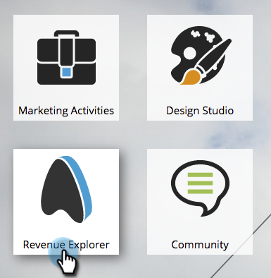

# 고급 프로그램 보고 개요 {#advanced-program-reporting-overview}

**매출 주기 탐색기에는** 여러 분석 영역과 프로그램 효과를 측정할 수 있는 다양한 새로운 지표가 포함되어 있습니다.

여기 맛있는 것들이 많네요 확인해 보자!

## 분석 영역이란? {#whats-an-analysis-area}

분석 영역에는 각각 매출 탐색기 내의 서로 다른 데이터 세트와 지표가 포함됩니다. 각 영역은 보기 위해 선택한 보고 주제와 관련이 있습니다.

## 프로그램 분석 영역 {#program-analysis-areas}

* ** [프로그램 비용 분석](understanding-the-program-cost-analysis-area.md) **- 모든 프로그램에 대한 ROI를 확인하십시오.

* ** [프로그램 회원 분석](understanding-the-program-membership-analysis-area.md) **- 채널, 참여, 성공 기준 등을 기준으로 결과를 확인할 수 있습니다.

* ** [프로그램 기회 분석](understanding-the-program-opportunity-analysis-area.md) **- 배포, 매출 및 ROI를 기반으로 한 기회 창출

* ** [프로그램 매출 단계 분석](understanding-the-program-revenue-stage-analysis-area.md) **- 매출 주기 모델 내에서 특정 성공 단계에 도달한 새 이름입니다.

## 프로그램 분석 {#program-analyzers}

* **프로그램 분석기** - 성공 여부에 따라 신속하게 프로그램을 식별하고 리소스를 적절히 집중할 수 있습니다.

* **기회 영향 분석기** - 기회가 창출되는 프로그램 및 주요 참여가 미치는 영향을 측정하여 마케팅 기여도를 입증합니다.

## 보고서 옵션 {#report-options}

각 보고서에는 경험을 사용자 지정하는 데 도움이 되는 몇 가지 옵션이 있습니다.

>[!CAUTION]
>
>측정값 셀이 비어 있는 행/열(첫 번째 확인란)을 표시하는 옵션이 있지만 처리 속도가 느려지고 보고서 시간이 초과될 수도 있으므로 표시하지 않는 것이 좋습니다.

>[!NOTE]
>
>매출 주기 탐색기의 데이터는 마케팅 인스턴스에서 야간 업데이트됩니다. 따라서 Marketing To 내의 개인 및 계정 활동에 대한 변경 사항은 매출 주기 탐색기에 다음 영업일에 반영됩니다.

Revenue Analytics에 익숙해지면 프로그램과 효과에 대한 전체 통찰력을 얻을 수 있습니다.