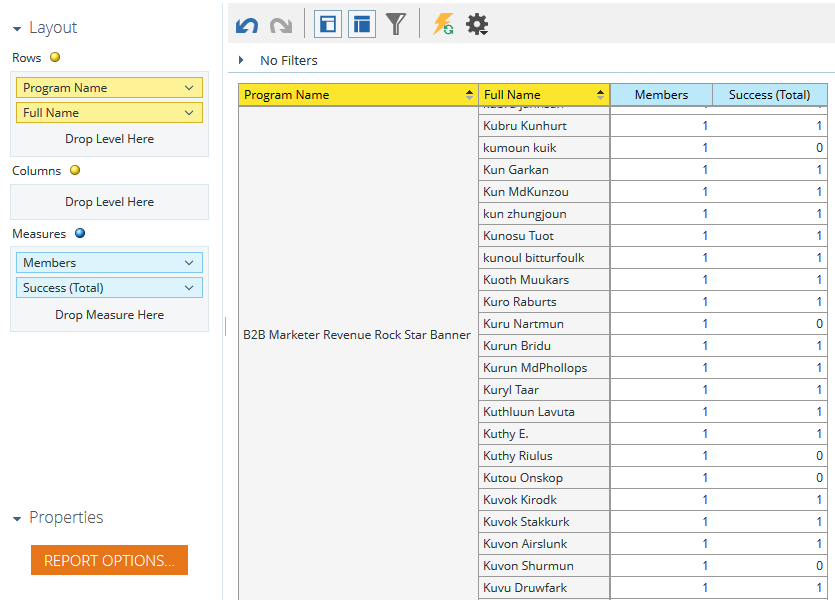

# {#build-a-program-membership-analysis-report-that-lists-leads} 리드를 나열하는 프로그램 구성원 분석 보고서 만들기

다음 단계에 따라 모든 프로그램 멤버 이름을 보여주는 프로그램 회원 분석 보고서를 만듭니다.

>[!AVAILABILITY]
>
>
>모든 고객이 이 기능을 구입하지는 않았습니다. 자세한 내용은 영업 담당자에게 문의하십시오.

1. 매출 탐색기를 시작합니다.

   

1. 새로 만들기를 클릭한 다음 보고서를 클릭합니다.

   

1. [프로그램 회원 분석]을 선택하고 [확인]을 클릭합니다.

   

1. 프로그램 이름 노란색 점을 찾아 두 번 클릭합니다.

   

1. 멤버 파란색 점을 찾아 두 번 클릭합니다.

   

1. 성공(합계) 파란색 점을 찾아 두 번 클릭합니다.

   

그게 얼마나 쉬운지 알아?

**전체 이름**&#x200B;과 같은 리드 속성을 빠르게 추가하여 구성원이 누구인지 확인할 수 있습니다.

>[!TIP]
>
>선택할 수 있는 리드/회사 속성이 많습니다. 확인해!

1. 전체 이름 노란색 점을 찾아 두 번 클릭합니다.

   

여기 있어요!

