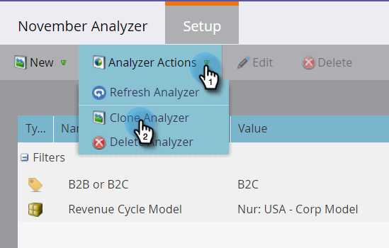
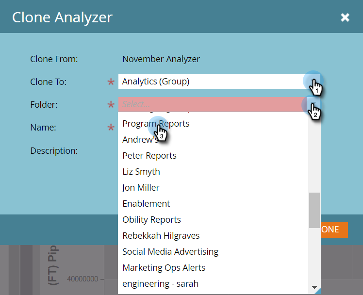

# 프로그램 분석기 복제 {#clone-a-program-analyzer}

분석기를 저장하면 쉽게 복제하여 새 분석기를 만들 수 있습니다. 그런 다음 로 이동하여 새로운 변경 사항이 필요한 경우 편집합니다.

1. **[!UICONTROL Analytics]** 타일을 클릭합니다.

   

1. **[!UICONTROL Program Analyzer]** 타일을 클릭합니다.

   

1. 저장된 분석기가 열려 있는 동안 [분석기 작업] 드롭다운을 열고 **[!UICONTROL Clone Analyzer]**&#x200B;을(를) 선택합니다.

   

1. **[!UICONTROL Clone To]** 및 **[!UICONTROL Folder]** 드롭다운에서 복제된 분석기의 위치를 선택하십시오.

   

1. 복제된 분석기 이름을 지정하고 **[!UICONTROL Clone]**&#x200B;을(를) 클릭합니다.

   

1. 이제 이름이 다른 두 개의 동일한 분석기를 사용할 수 있습니다. 필요한 변경을 수행하려면 클론을 엽니다.

   

   >[!MORELIKETHIS]
   >
   >[[!UICONTROL Program Analyzer]](/help/marketo/product-docs/reporting/revenue-cycle-analytics/program-analytics/create-a-program-analyzer.md) 만들기
