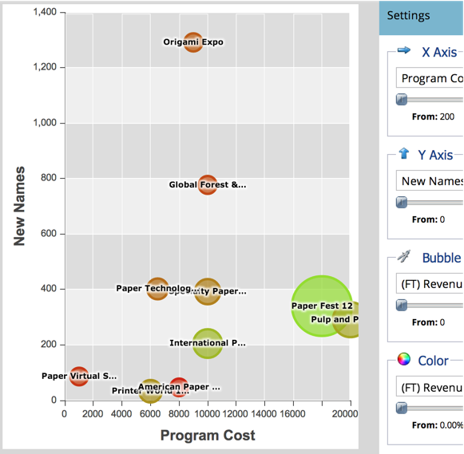

# 프로그램 분석기와 프로그램 효과 비교 {#compare-program-effectiveness-with-the-program-analyzer}

프로그램 분석기를 사용하여 프로그램 비용, 회원 확보, 파이프라인 및 매출을 비교하여 가장 효과적인 프로그램을 식별합니다.

>[!NOTE]
>
>**사전 요구 사항**
>
>* [프로그램 분석기 만들기](create-a-program-analyzer.md)

1. 분석을 클릭합니다.

   

1. 프로그램 분석기를 선택합니다.

   

1. 보기를 프로그램으로 변경합니다.

   

1. 채널 필터를 사용하여 보기를 하나 또는 두 개의 채널로 축소합니다. 지금으로서는 트레이드쇼 채널에서 프로그램을 살펴보겠습니다.

   

   >[!TIP]
   >
   >프로그램을 한 채널만 필터링하는 빠른 방법은 [ **보기] > [채널별**]을 선택하고 해당 채널의 버블을 클릭한 다음 팝업 대화 상자에서 채널 이름을 클릭하는 것입니다.

1. X축 드롭다운을 사용하여 가로 축에 대한 지표를 선택합니다. 프로그램 비용으로 시작합니다.

   

1. Y축 드롭다운을 사용하여 세로 축에 대한 지표를 선택합니다. 새 이름을 선택하여 새 리드를 캡처하는 데 유용한 프로그램을 찾습니다.

   

1. 슬라이더를 켜서 확대합니다.

   

   >[!TIP]
   >
   >또한 선형에서 로그 배율로 또는 그 반대로 변경하여 보기를 개선할 수도 있습니다. 맨 위에 있는 **크기** 조절 메뉴를 사용합니다.

1. 결과 그래프를 살펴보십시오.

   

   우리의 예에서, 우리는 종이접기 엑스포가 새로운 이름을 캡처하는 다른 모든 프로그램보다 훨씬 더 저렴하고 적당한 가격으로 훨씬 더 낫다는 것을 배웁니다. 하지만 그게 전부가 아닙니다. 보다 심층적인 이해를 위해 두 개의 지표를 더 추가할 예정입니다.

1. 버블 크기 드롭다운을 사용하여 버블 크기별로 비교할 지표를 선택합니다. 예를 들어 FT(매출 원)를 선택합니다.

   

   >[!NOTE]
   >
   >프로그램 분석기에서 선택할 수 있는 많은 지표는 첫 번째 터치(FT) 및 다중 터치(MT) 계산에서 사용할 수 있습니다. FT와 MT 속성의 [차이를 이해하는 것이 중요합니다](/help/marketo/product-docs/reporting/revenue-cycle-analytics/revenue-tools/attribution/understanding-attribution.md).

1. 그래프에서 버블 변경 크기를 확인합니다.

   

   우리는 **(FT) 수입 원화를**&#x200B;추가함으로써, 오리가미 엑스포가 많은 새로운 이름을 얻었지만, 그것은 비교적 적은 수익을 얻을 수 있다는 것을 빠르게 볼 수 있다. 특히 종이페스트 12 프로그램이 더 많은 매출(더 큰 거품)에 영향을 미치면서 점점 유명해지고 있다.

1. 색상 드롭다운을 사용하여 네 번째 지표를 추가합니다. FT(Revenue to Investment)를 살펴보겠습니다.

   

1. 그래프에서 색상 변화를 확인할 수 있습니다.

   

Paper Fest 12 프로그램은 더 많은 매출(더 큰 버블)에 영향을 줄 뿐만 아니라 상대적으로 높은 프로그램 비용(맨 오른쪽에 있음)에도 불구하고 Tradeshow 채널의 모든 프로그램에 대한 투자 수익(가장 친환경적인 버블)이 가장 높습니다.

>[!TIP]
>
>한 채널의 프로그램과 다른 채널의 프로그램을 신속하게 비교할 수 있습니다. 창 상단에 있는 **채널 필터를** 사용하여 채널을 더 추가합니다.

>[!NOTE]
>
>**관련 문서**
>
>* [프로그램 분석기를 사용하여 프로그램 및 채널 세부 사항 살펴보기](explore-program-and-channel-details-with-the-program-analyzer.md)
>* [프로그램 분석기와 채널 효과 비교](compare-channel-effectiveness-with-the-program-analyzer.md)

>[!NOTE]
>
>Revenue Cycle Explorer의 고급 [분석에 대해 자세히 알아보십시오](http://docs.marketo.com/display/docs/revenue+cycle+analytics).
