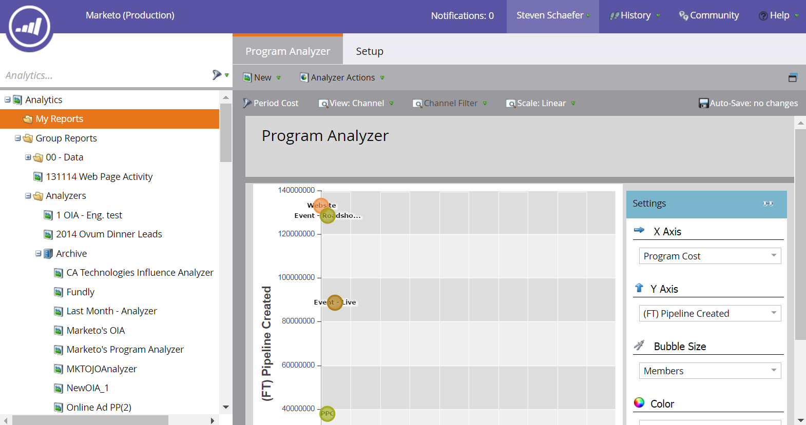
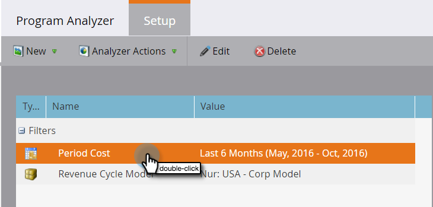

# 프로그램 분석기 만들기 {#create-a-program-analyzer}

마케팅 성과를 극대화하는 프로그램과 채널을 살펴볼 수 있습니다. 프로그램 분석기를 사용하여 프로그램 또는 채널별로 모든 비용과 수익을 세밀하게 분석하고 비교할 수 있습니다.

>[!NOTE]
>
>**미리 알림**
>
>프로그램 분석기에서 좋은 데이터를 얻으려면 CRM 연락처가 기회의 역할을 가지고 있고 Marketing 프로그램이 [기간 비용](/help/marketo/product-docs/reporting/revenue-cycle-analytics/revenue-tools/define-period-costs.md), 프로그램 상태 및 성공을 정의하면서 완전히 설정되었는지 확인하십시오.

>[!TIP]
>
>프로그램 분석기에 비용 없이 프로그램을 표시하려면 해당 기간 비용을  $0로 설정합니다.

1. 분석 타일을 클릭합니다.

   

1. 프로그램 분석기 타일을 클릭합니다.

   

1. 표준 프로그램 분석기가 나타납니다. 필요한 내용을 변경합니다.

   

1. 필터를 추가하고 사용자 정의하려면 설정 탭을 클릭합니다.

   

1. 예를 들어 기간 비용 필터를 사용자 정의하려면 해당 필터를 두 번 클릭합니다.

   

1. 분석할 기간을 선택하고 적용을 클릭합니다.

   

   >[!TIP]
   >
   >특정 범위를 선택하려면 사용자 지정 **을** 선택하고 **시작 및 끝** 필드 **를** 사용합니다.

1. 새 사용자 지정 분석기를 저장하려면 Analyzer 작업 드롭다운에서 다른 이름으로 저장을 선택합니다.

   

1. 저장 위치 및 폴더 드롭다운을 사용하여 사용자 지정 분석기를 저장할 위치를 선택합니다. 새 사용자 지정 분석기의 이름을 지정합니다. 설명은 선택 사항입니다. 저장을 클릭합니다.

   

1. 네가 해냈어! 기본 탭을 클릭하여 프로그램과 채널 탐색을 시작하고 비교합니다.

>[!NOTE]
>
>**관련 문서**
>
>* [프로그램 분석기와 채널 효과 비교](compare-channel-effectiveness-with-the-program-analyzer.md)
>* [프로그램 분석기와 프로그램 효과 비교](compare-program-effectiveness-with-the-program-analyzer.md)
>* [프로그램 분석기를 사용하여 프로그램 및 채널 세부 사항 살펴보기](explore-program-and-channel-details-with-the-program-analyzer.md)
>* [프로그램 분석기 복제](clone-a-program-analyzer.md)

>[!NOTE]
>
>프로그램 분석기에서 선택할 수 있는 많은 지표는 첫 번째 터치(FT) 및 다중 터치(MT) 계산에서 사용할 수 있습니다. FT와 MT 속성의 [차이를 이해하는 것이 중요합니다](/help/marketo/product-docs/reporting/revenue-cycle-analytics/revenue-tools/attribution/understanding-attribution.md).

>[!NOTE]
>
>기본 보고 및 [매출](http://docs.marketo.com/display/docs/basic+reporting) 주기 탐색기에서 [자세한 내용을 살펴보십시오](http://docs.marketo.com/display/docs/revenue+cycle+analytics).
