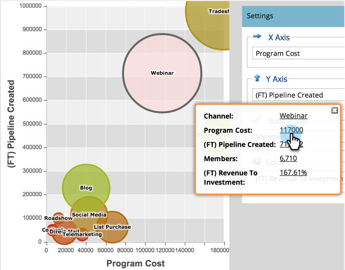

# [!UICONTROL Program Analyzer]&#x200B;(으)로 프로그램 및 채널 세부 정보 탐색 {#explore-program-channel-details-with-the-program-analyzer}

[!UICONTROL Program Analyzer]에서 자세한 프로그램 및 채널 통계를 볼 수 있습니다. 수익 주기 탐색기에서 열 수도 있습니다.

>[!PREREQUISITES]
>
>[[!UICONTROL Program Analyzer]](/help/marketo/product-docs/reporting/revenue-cycle-analytics/program-analytics/create-a-program-analyzer.md) 만들기

>[!AVAILABILITY]
>
>일부 Marketo 버전에는 이 기능이 포함되어 있지 않습니다. 자세한 내용은 계정 관리자에게 문의하십시오.

1. **[!UICONTROL Analytics]**&#x200B;을(를) 클릭합니다.

   

1. 프로그램 분석기를 선택합니다.

   

1. 선택한 **[!UICONTROL View]**&#x200B;에 따라 채널 또는 프로그램의 특정 통계를 보려면 해당 버블을 클릭합니다.

   

   >[!NOTE]
   >
   >프로그램 분석기에서 선택할 수 있는 많은 지표는 FT(첫 번째 터치) 및 MT(다중 터치) 계산을 통해 사용할 수 있습니다. FT와 MT 속성의 [차이점](/help/marketo/product-docs/reporting/revenue-cycle-analytics/revenue-tools/attribution/understanding-attribution.md)을 이해하는 것이 중요합니다.

1. 단일 채널 내의 모든 프로그램을 비교하려면 팝업 대화 상자에서 채널 이름을 클릭합니다.

   

1. 이제 해당 채널 내의 개별 프로그램을 비교할 수 있습니다!

   

   >[!NOTE]
   >
   >단일 채널을 클릭하면 보기가 프로그램별로 전환되며 해당 채널로만 필터링됩니다. 모든 채널로 돌아가려면 **[!UICONTROL View]** > **[!UICONTROL By Channel]**&#x200B;을(를) 선택합니다.

1. 매출 주기 탐색기를 열어 통계를 더 자세히 알아보려면 팝업 대화 상자에서 해당 숫자를 클릭합니다.

   
