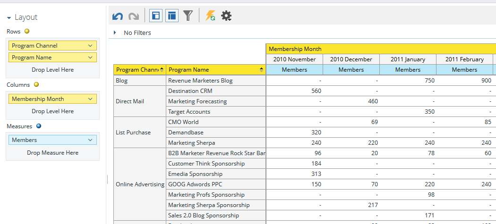

# 프로그램 회원 분석 영역 이해 {#understanding-the-program-membership-analysis-area}

프로그램 회원 분석 영역을 사용하면 개별 프로그램의 효과를 분석하거나 지정된 기간 동안 채널별로 요약된 결과를 볼 수 있습니다.

## 비즈니스 질문 예 {#example-business-questions}

한 달에 몇 명이 채널별로 프로그램에 참여했습니까?

주어진 프로그램의 성공 기준에 얼마나 많은 사람들이 도달했는가?

프로그램/채널당 한 달에 몇 개의 새로운 이름이 생성되었습니까?

## 프로그램 회원 분석 Dimension 및 조치 {#program-membership-analysis-dimensions-and-measures}

>[!NOTE]
>
>노란색 점들은 치수이고 파란색 점들은 측정입니다.

### 멤버십 {#membership}

| 측정 | 설명 |
|---|---|
| 새 이름 % | 프로그램에서 획득한 리드 비율 |
| 멤버 | 프로그램의 총 리드 수 |
| 새 이름 | 프로그램에서 취득한 총 새 이름 |

### 프로그램 속성 {#program-attributes}

| Dimension | 설명 |
|---|---|
| 프로그램 채널 | 프로그램 채널 |
| 프로그램 이름 | 프로그램 이름 |

### 프로그램 회원 기간 {#program-membership-timeframe}

| Dimension | 설명 |
|---|---|
| 연도 | 프로그램 회원 기간 |
| 분기 | 프로그램 회원 기간 |
| 월 | 프로그램 회원 기간 |
| 주 | 프로그램 회원 기간 |
| 날짜 | 프로그램 회원 기간 |

### 성공 {#success}

| 측정 | 설명 |
|---|---|
| % 성공(새 이름) | 프로그램 AND에 의해 취득되어 프로그램 진행 중에 성공한 리드 비율 |
| % 성공(합계) | 프로그램 진행 중에 성공한 리드 비율 |
| 성공(새 이름) | 프로그램 진행 중에 성공한 총 새 이름 수 |
| 성공(합계) | 프로그램 진행 중에 성공한 총 리드 수 |

