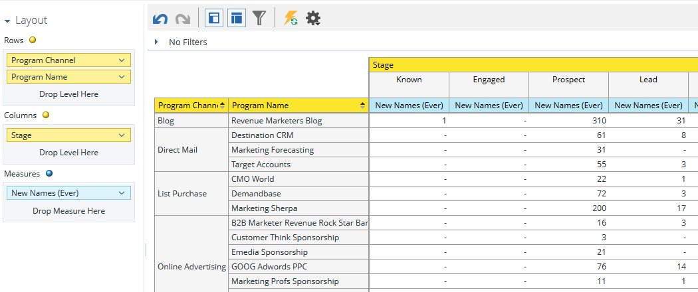
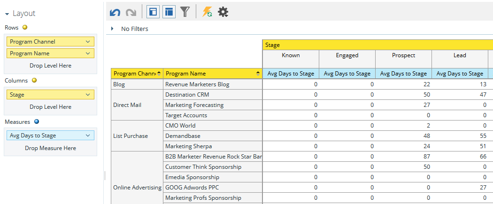

# 프로그램 매출 단계 분석 영역 이해 {#understanding-the-program-revenue-stage-analysis-area}

이 분석 영역에서는 개별 프로그램의 효과를 분석하거나 채널별로 요약된 결과를 볼 수 있습니다. 이렇게 하면 새로 생성된 이름 중 몇 개가 매출 주기 모델 내에서 특정 성공 경로 단계에 도달했는지 알 수 있습니다.

**이 분석 영역을 사용하여 답변할 수 있는 비즈니스 질문의 예는 다음과 같습니다.**

해당 프로그램에서 몇 개의 새 이름이 내 모델의 특정 단계에 도달했습니까?

주어진 프로그램의 새 이름이 현재 내 모델의 특정 단계에 몇 개입니까?

현재 단계에 도달하는 데 며칠이 걸립니까?

**프로그램 수익 단계 분석 Dimension 및 대책**

Dimension 및 측정은 기능별로 분류되며 시스템에서 노란색 또는 파란색 점으로 표시됩니다.측정값은 노란색이고 측정값은 파란색입니다. 프로그램 매출 단계 분석 차원 및 측정값을 사용하여 보고서의 특정 질문에 답변합니다.

카테고리 내의 사용 가능한 차원이나 측정값을 보려면 카테고리 이름 옆에 있는 오른쪽 화살표를 클릭하여 카테고리 목록을 확장합니다. 아래쪽 화살표를 클릭하여 범주 목록을 축소합니다.

>[!TIP]
>
>보고서에 있는 동안 특정 차원이나 측정값에 대한 자세한 정보를 보려면 마우스를 위로 가져갑니다.

**모델 특성**

<table> 
 <tbody> 
  <tr> 
   <td colspan="1" rowspan="1"><strong>Dimension</strong></td> 
   <td colspan="1" rowspan="1">
<strong>설명</strong>
</td> 
  </tr> 
  <tr> 
   <td colspan="1" rowspan="1">
모델이 활성 상태임
</td> 
   <td colspan="1" rowspan="1">
모델이 현재 승인되어 활성 상태인지 여부를 설명합니다.
</td> 
  </tr> 
  <tr> 
   <td colspan="1" rowspan="1">
스테이지가 활성 상태임
</td> 
   <td colspan="1" rowspan="1">
스테이지가 활성 상태인지 여부를 설명합니다.
</td> 
  </tr> 
  <tr> 
   <td colspan="1" rowspan="1">
성공 경로에서
</td> 
   <td colspan="1" rowspan="1">
스테이지가 성공 경로에 있는지 여부를 설명합니다.
</td> 
  </tr> 
  <tr> 
   <td colspan="1" rowspan="1">
모델
</td> 
   <td colspan="1" rowspan="1">
모델 이름
</td> 
  </tr> 
  <tr> 
   <td colspan="1" rowspan="1">
스테이지
</td> 
   <td colspan="1" rowspan="1">
매출 주기 모델에 있는 단계입니다. 두 단계 사이의 측정값을 분석할 때 시작 단계로 사용됩니다.
</td> 
  </tr> 
  <tr> 
   <td colspan="1" rowspan="1">
스테이지 유형
</td> 
   <td colspan="1" rowspan="1">
유형 설명;각 단계에서 인벤토리, SLA 또는 게이트
</td> 
  </tr> 
 </tbody> 
</table>

**프로그램 속성**

<table> 
 <tbody> 
  <tr> 
   <td colspan="1" rowspan="1">
<strong>Dimension</strong>
</td> 
   <td colspan="1" rowspan="1">
<strong>설명</strong>
</td> 
  </tr> 
  <tr> 
   <td colspan="1" rowspan="1">
프로그램 채널
</td> 
   <td colspan="1" rowspan="1">
프로그램 채널
</td> 
  </tr> 
  <tr> 
   <td colspan="1" rowspan="1">
프로그램 이름
</td> 
   <td colspan="1" rowspan="1">
프로그램 이름
</td> 
  </tr> 
 </tbody> 
</table>

**프로그램 비용 일정**

<table> 
 <tbody> 
  <tr> 
   <td colspan="1" rowspan="1">
<strong>Dimension</strong>
</td> 
   <td colspan="1" rowspan="1">
<strong>설명</strong>
</td> 
  </tr> 
  <tr> 
   <td colspan="1" rowspan="1">
비용 연도
</td> 
   <td colspan="1" rowspan="1">
프로그램 비용 일정
</td> 
  </tr> 
  <tr> 
   <td colspan="1" rowspan="1">
비용 분기
</td> 
   <td colspan="1" rowspan="1">
프로그램 비용 일정
</td> 
  </tr> 
  <tr> 
   <td colspan="1" rowspan="1">
비용 월
</td> 
   <td colspan="1" rowspan="1">
프로그램 비용 일정
</td> 
  </tr> 
 </tbody> 
</table>

**단계 멤버십**

<table> 
 <tbody> 
  <tr> 
   <td colspan="1" rowspan="1">
<strong>측정</strong>
</td> 
   <td colspan="1" rowspan="1">
<strong>설명</strong>
</td> 
  </tr> 
  <tr> 
   <td colspan="1" rowspan="1">
모델이 활성 상태임
</td> 
   <td colspan="1" rowspan="1">
모델이 현재 승인되어 활성 상태인지 여부를 설명합니다.
</td> 
  </tr> 
  <tr> 
   <td colspan="1" rowspan="1">
스테이지가 활성 상태임
</td> 
   <td colspan="1" rowspan="1">
스테이지가 활성 상태인지 여부를 설명합니다.
</td> 
  </tr> 
  <tr> 
   <td colspan="1" rowspan="1">
성공 경로에서
</td> 
   <td colspan="1" rowspan="1">
스테이지가 성공 경로에 있는지 여부를 설명합니다.
</td> 
  </tr> 
  <tr> 
   <td colspan="1" rowspan="1">
새 이름당 비용
</td> 
   <td colspan="1" rowspan="1">
단계에 도달한 새 이름의 평균 비용
</td> 
  </tr> 
  <tr> 
   <td colspan="1" rowspan="1">
새 이름(현재)
</td> 
   <td colspan="1" rowspan="1">
현재 스테이지에 있고 프로그램에서 인수된 총 리드 수
</td> 
  </tr> 
  <tr> 
   <td colspan="1" rowspan="1">
새 이름(이전 버전)
</td> 
   <td colspan="1" rowspan="1">
유형 설명;각 단계에서 인벤토리, SLA 또는 게이트
</td> 
  </tr> 
 </tbody> 
</table>

>[!MORELIKETHIS]
>
>[매출 탐색기 보고서 만들기](../../../../product-docs/reporting/revenue-cycle-analytics/revenue-explorer/create-a-revenue-explorer-report.md)
