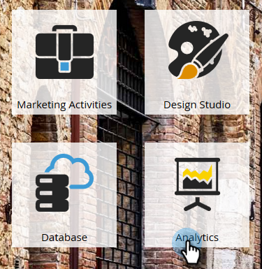

# 매출 모델 승인/승인 취소 {#approve-unapprove-a-revenue-model}

지정된 시간에 한 개의 승인된 모델만 있을 수 있습니다.

>[!CAUTION]
>
>[개별 단계를 승인해야 합니다](/help/marketo/product-docs/reporting/revenue-cycle-analytics/revenue-cycle-models/approving-stages-and-assigning-leads-to-a-revenue-model.md) 및 전체 모델을 승인하기 전에 추가된 사람.

## 승인 {#approve}

1. 로 이동합니다. **Analytics** 영역.

   

1. 트리에서 모델을 선택합니다.

   

1. 에서 **모델 작업** 메뉴, 선택 **모델 승인**.

   

1. 선택을 확인하는 대화 상자가 나타납니다. 클릭 **승인**.

   

이제 모델은 라이브 상태가 되었습니다!

## 비승인 {#unapprove}

>[!CAUTION]
>
>모델 승인을 취소하면 모든 사용자가 모델에서 제거되고 모델의 해당 기록이 삭제됩니다.

1. 로 이동합니다. **Analytics** 영역.

   

1. 트리에서 모델을 선택합니다.

   

1. 을(를) 클릭합니다. **모델 작업** 메뉴 및 선택 **모델 비승인**.

   

1. 대화 상자가 나타나면 **모델 비승인**.

   

축하합니다! 이제 모델이 승인되지 않았습니다.

>[!CAUTION]
>
>모델 승인을 취소하면 모델에서 모든 사용자가 제거되고 모델의 내역이 데이터베이스에서 제거됩니다.
