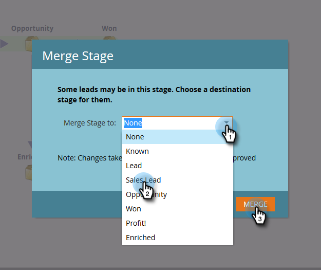

# 승인된 모델 편집 {#editing-your-approved-model}

## 모델 편집 {#editing-your-model}

1. Analytics 섹션에서 변경할 모델을 선택하고 을(를) 클릭합니다 **초안 편집**.

   

1. 초안 모델을 편집할 때(모델이 승인된 후) 단계를 삭제할 수 없습니다. 대신 해당 스테이지를 모델의 다른 스테이지와 병합할 수 있습니다. 병합할 스테이지를 마우스 오른쪽 단추로 클릭하고 **병합**.

   

1. 현재 선택한 리드에 대해 새 스테이지를 선택하거나 **없음** 모델에서 리드를 제거합니다. 완료되면 을(를) 클릭합니다. **병합**.

   

1. 모델을 변경한 후 을(를) 선택하여 다시 승인합니다 **모델 초안 승인** 에서 **모델 작업** 메뉴 아래의 제품에서 사용할 수 있습니다.

   

   >[!TIP]
   >
   >단계 추가 또는 병합과 같이 단계를 변경하는 경우 편집 내용을 반영하도록 지정 규칙 및 단계를 변경해야 합니다.

## 모델 승인 취소 {#unapproving-your-model}

>[!CAUTION]
>
>모델의 승인을 취소하면 모든 리드가 제거되고 모델의 해당 기록이 삭제됩니다. 모델을 승인하지 않고 편집하는 것이 좋습니다.

1. 승인을 취소할 모델을 선택합니다. 에서 **모델 작업** 메뉴, 선택 **모델 비승인**.

   

1. 클릭 **비승인**.

   

>[!NOTE]
>
>이 모델을 다시 승인하려면 먼저 리드를 단계에 재할당해야 합니다.

## 추가 모델 만들기 {#creating-more-models}

한 번에 하나의 승인된 모델만 가질 수 있습니다. 모델을 승인하지만 이미 하나의 승인자가 있는 경우, 먼저 현재 모델의 승인을 취소해야 합니다. 가능하면 새 모델을 만드는 대신 모델을 편집해 보십시오.

>[!MORELIKETHIS]
>
>[새 매출 모델 만들기](/help/marketo/product-docs/reporting/revenue-cycle-analytics/revenue-cycle-models/create-a-new-revenue-model.md)
