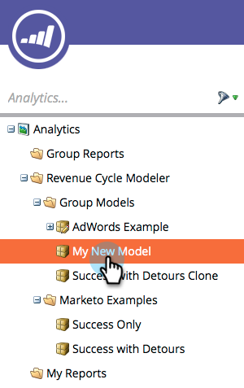

# 단계 승인 및 리드 할당 결과 매출 모델 {#approving-stages-and-assigning-leads-to-a-revenue-model}

기존 리드 **를 추가하고****** 새로운 리드에 대한 할당 규칙을 만들어 수익 모델을 가동하고 실행할 수 있습니다.

## 단계 승인 {#approving-stages}

리드를 추가하기 전에 모델의 단계를 승인하겠습니다.

1. **분석 **영역으로 이동합니다.** **

   

1. 단계 승인을 원하는 모델을 선택합니다.

   

1. 모델 **작업**&#x200B;아래에서 단계 **승인** 을 **선택합니다**.

   

1. 여러분은 경고를 받게 될 것입니다.리드 **할당을 클릭합니다**.

   

훌륭해! 리드를 할당해 보겠습니다.

## 기존 리드 할당 {#assigning-existing-leads}

[리드](../../../../product-docs/core-marketo-concepts/smart-lists-and-static-lists/creating-a-smart-list/create-a-smart-list.md) 데이터베이스에서 모델의 한 단계에 대한 리드를 식별하는 스마트 목록을 만듭니다.

1. 스마트 목록 [을](../../../../product-docs/core-marketo-concepts/smart-lists-and-static-lists/creating-a-smart-list/create-a-smart-list.md)만들었으면 리드 **탭을** 클릭합니다.

   

1. 모두 **선택을** 클릭하여 리드를 선택합니다.

   

1. 리드 **작업** 드롭다운을 열고 **특별을 선택합니다**. 매출 **단계 변경을 클릭합니다**.

   

1. 올바른 **모델** 및 올바른 **단계를 선택합니다**. 지금 **실행을 클릭합니다**.

   

1. 모든 리드가 모델의 다양한 단계에 지정될 때까지 이 단계를 반복합니다.

좋아요! 새 리드가 스테이지에 할당되는 방식을 지정하려면 할당 규칙을 만듭니다.

>[!NOTE]
>
>모델이 승인된 단계 상태인 경우 리드 활동 로그에 매출 단계 변경 이벤트가 표시되지 않습니다. 모델이 완전히 승인된 경우 현재 있는 동일한 단계로 리드를 이동하면 이 흐름 단계를 건너뜁니다.

## 새 리드:할당 규칙 만들기  {#new-leads-create-assignment-rules}

1. 다시** Marketing Home**을 클릭한 다음 **Analytics를 선택합니다**.

   

1. `Click your model in the tree, then the`**`Model Actions`**`menu, selecting`**`Assignment Rules`** `.`

   

1. `If your assignment rules contain more than just one default choice click **Stage, **make your selection, then click`**`Add Choice`**`.`

   

## 할당 규칙 예 {#example-assignment-rule}

리드 점수 규칙을 만들어 최소 점수가 있는 새 리드를 적절한 단계에 지정합니다.

1. [ **if**] 아래에서 **리드 점수를 선택합니다**. 그런 다음 **적어도**&#x200B;선택하십시오.&#39; 

   `

1. 필드에 **40** 을 입력하고 **영업** 리드를 스테이지로 선택합니다. 저장을 **클릭하여** 완료합니다.

   

>[!NOTE]
>
>**관련 문서**
>
>모델을 승인하려면 ** 매출 모델 [승인 및 미승인](approve-unapprove-a-revenue-model.md)**의 도움말 페이지를 참조하십시오.

