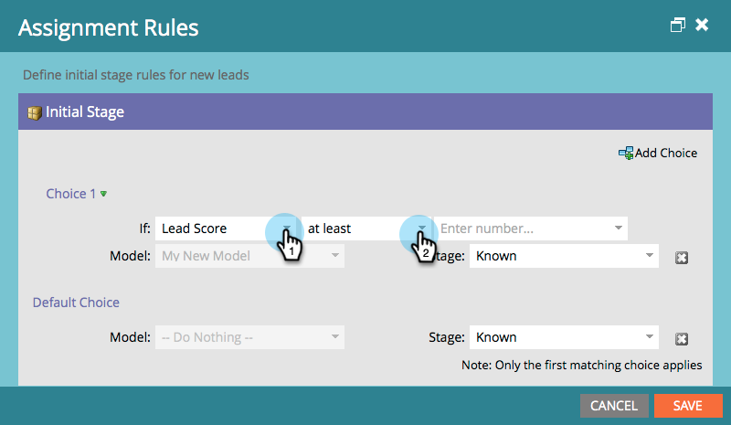

# 단계 승인 및 수익 모델에 리드 지정 {#approving-stages-and-assigning-leads-to-a-revenue-model}

기존 리드를 추가하고 새 리드에 대한 할당 규칙을 만들어 **수익 모델**&#x200B;을 설정하고 실행합니다.

## 단계 승인 {#approving-stages}

리드를 추가하기 전에 모델의 단계를 승인하겠습니다.

1. **Analytics** 영역으로 이동합니다.

   

1. 승인할 단계가 있는 모델을 선택합니다.

   

1. **모델 작업**&#x200B;에서 **단계 승인**&#x200B;을 선택합니다.

   

1. 알림이 표시됩니다. **잠재 고객 할당**&#x200B;을 클릭하세요.

   

훌륭합니다! 계속해서 해당 리드를 할당해 보겠습니다.

## 기존 리드 할당 {#assigning-existing-leads}

리드 데이터베이스에서 모델의 한 단계에 대한 리드를 식별하려면 [스마트 목록을 만듭니다](/help/marketo/product-docs/core-marketo-concepts/smart-lists-and-static-lists/creating-a-smart-list/create-a-smart-list.md).

1. [스마트 목록을 만들었으면](/help/marketo/product-docs/core-marketo-concepts/smart-lists-and-static-lists/creating-a-smart-list/create-a-smart-list.md) **리드** 탭을 클릭하세요.

   

1. 리드를 선택하려면 **모두 선택**&#x200B;을 클릭하세요.

   

1. **리드 동작** 드롭다운을 열고 **특별 항목**&#x200B;을 선택합니다. **수익 단계 변경**&#x200B;을 클릭합니다.

   

1. 올바른 **모델** 및 올바른 **단계**&#x200B;를 선택하십시오. **지금 실행**&#x200B;을 클릭합니다.

   

1. 모든 잠재 고객이 모델의 다양한 단계에 할당될 때까지 반복합니다.

잘됐네! 단계에 신규 가망 고객을 지정하는 방법을 지정하려면 지정 규칙을 생성합니다.

>[!NOTE]
>
>모델이 Approved Stages 상태인 경우 리드의 활동 로그에 Change Revenue Stage 이벤트가 표시되지 않습니다. 모델이 완전히 승인된 경우 리드를 현재 있는 동일한 단계로 이동하면 이 흐름 단계를 건너뜁니다.

## 신규 가망 고객: 지정 규칙 생성  {#new-leads-create-assignment-rules}

1. **Marketo 홈**&#x200B;을 다시 클릭한 다음 **분석**&#x200B;을 선택합니다.

   

1. 트리에서 모델을 클릭한 다음 **모델 작업** 메뉴를 클릭하여 **할당 규칙**&#x200B;을 선택합니다.

   

1. 할당 규칙에 기본 선택 항목이 둘 이상인 경우 **단계**&#x200B;를 클릭하고 선택한 다음 **선택 항목 추가**&#x200B;를 클릭하십시오.

   

## 할당 규칙 예 {#example-assignment-rule}

Lead Score 규칙을 만들어 최소 점수가 있는 새로운 Lead 를 적절한 단계에 할당합니다.

1. **If**&#x200B;에서 **리드 점수**&#x200B;를 선택합니다. 그런 다음 **최소**&#x200B;을(를) 선택하십시오.

   

1. 필드에 **40**&#x200B;을(를) 입력하고 **판매 잠재 고객**&#x200B;을(를) 단계로 선택합니다. 완료하려면 **저장**&#x200B;을 클릭하세요.

   

>[!MORELIKETHIS]
>
>모델을 승인하려면 **[수익 모델 승인 및 승인 취소](/help/marketo/product-docs/reporting/revenue-cycle-analytics/revenue-cycle-models/approve-unapprove-a-revenue-model.md)**&#x200B;의 도움말 페이지를 읽어 보십시오.
