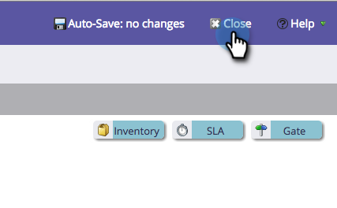

# 스테이지 이름 변경 {#changing-the-name-of-a-stage}

마음을 바꿔요? 문제 없어 매출 주기 모델러에서 스테이지의 이름을 쉽게 바꿀 수 있습니다.

1. 로 이동합니다. **Analytics** 영역.

   

1. 업데이트할 수익 주기 모델을 선택합니다. 클릭 **초안 편집**.

   

1. 업데이트할 단계를 선택하고 새 단계를 입력합니다 **이름**.

   

1. Click **Close**.

   

   봤지? 진정해! 잊지 말고 [모델 승인](/help/marketo/product-docs/reporting/revenue-cycle-analytics/revenue-cycle-models/approve-unapprove-a-revenue-model.md).
