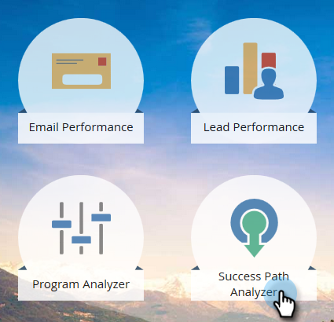

# 성공 경로 분석기 만들기 {#create-a-success-path-analyzer}

[매출 주기 모델](http://docs.marketo.com/display/docs/revenue+cycle+analytics)을 통해 속도와 흐름을 시각적으로 표현할 수 있습니다.

>[!PREREQUISITES]
>
>[새 매출 모델 만들기](create-a-new-revenue-model.md)

1. 분석 타일을 클릭합니다.

   

1. 성공 경로 분석기 아이콘을 클릭합니다.

   

   >[!NOTE]
   >
   >지정된 시간대에 데이터가 없다는 경고가 표시되면 **닫기**&#x200B;를 클릭하여 시간대를 변경합니다. 메시지가 표시되지 않지만 시간대를 변경하려는 경우 **설정**&#x200B;으로 이동하고****시간 프레임**&#x200B;을 두 번 클릭합니다.

1. 데이터가 없거나 시간대를 변경하는 경우 드롭다운에서 하나를 선택하고 저장을 클릭합니다.

   

   >[!TIP]
   >
   >특정 범위를 선택하려면 **사용자 지정**&#x200B;을 선택하고 **시작** 및 **끝** 필드를 사용합니다.

1. 둘 이상의 매출 주기 모델이 있는 경우 설정 탭에서 원하는 모델을 선택합니다.

   

1. 적절한 모델을 선택하고 적용을 클릭합니다.

   

1. 성공 경로 분석기 탭을 클릭합니다.

   

이제 각 단계에서 다음 단계로 이동할 수 있습니다.

>[!TIP]
>
>보고서를 저장하시겠습니까? **분석기 작업** 드롭다운을 클릭하고 **다른 이름으로 저장**&#x200B;을 선택합니다.

>[!MORELIKETHIS]
>
>* [성공 경로 분석기 사용](using-the-success-path-analyzer.md)

>

