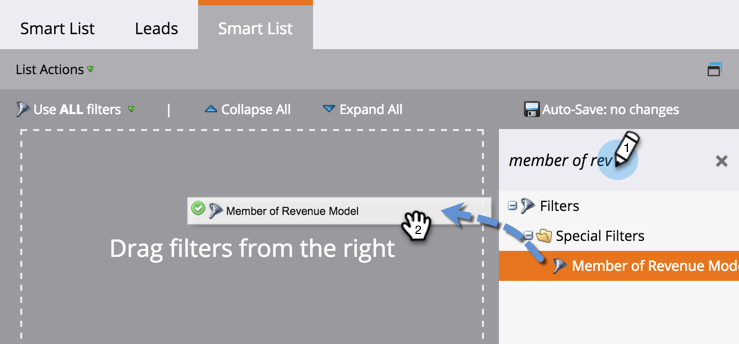
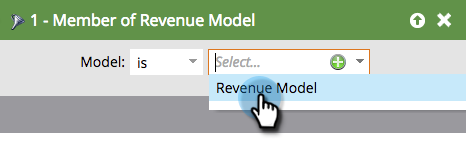

# 매출 주기 모델에서 모든 리드 찾기 {#find-all-leads-in-a-revenue-cycle-model}

스마트 목록을 사용하면 수익 주기 모델의 모든 멤버를 쉽게 찾을 수 있습니다.

>[!NOTE]
>
>**사전 요구 사항**
>
>[스마트 목록 만들기](../../../../product-docs/core-marketo-concepts/smart-lists-and-static-lists/creating-a-smart-list/create-a-smart-list.md)

1. 스마트 목록이 선택된 상태에서 **스마트 목록** 탭을 클릭합니다.

   

1. 매출 모델 **의 멤버** 필터를 찾아 캔버스로 드래그합니다.

   

1. 모델을 **선택합니다**.

   

   그러면 스테이지에 상관없이 해당 모델의 모든 리드가 표시됩니다. 보통 특정한 무대를 원하실 겁니다 다음 필터를 대신 사용하십시오.

1. **수익 단계 **필터를 찾아 캔버스로 드래그합니다.

   

1. 스테이지를 **선택합니다.**

   

1. 리드 **탭으로** 이동하여 결과를 확인합니다.

   

   >[!TIP]
   >
   >두 개의 필터가 모두 필요한 것은 아닙니다. 필요한 필터를 선택하십시오. 우리는 단지 두 사람 모두 철저하다는 것을 보여주고 있다.  >

   >[!CAUTION]
   >
   >리드를 처음 생성하는 동안 외부 캠페인에 의해 리드 단계가 변경되는 경우, 데이터베이스에 활동이 로그인되지 않습니다. 즉, 리드가 스마트 목록 필터에 포함되지 않습니다.

