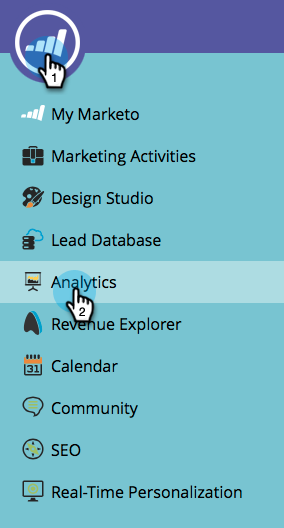

# Revenue Modeler에서 두 단계 병합 {#merging-two-stages-in-the-revenue-modeler}

모델을 승인한 후에는 초안을 편집할 때 단계를 삭제할 수 없습니다. 대신 해당 단계를 다른 단계와 병합할 수 있습니다.

1. **Marketo 홈**&#x200B;을 클릭하고 **[!UICONTROL Analytics]**&#x200B;을(를) 선택합니다.

   

1. 승인된 모델을 클릭합니다.

   

1. **[!UICONTROL Edit Draft.]**&#x200B;를 클릭합니다.

   

1. 병합할 단계를 마우스 오른쪽 단추로 클릭하고 메뉴에서 **[!UICONTROL Merge]단계**&#x200B;을(를) 선택합니다.

   

1. 풀다운에서 특정 단계를 클릭합니다.

   

1. **[!UICONTROL Approve Model Draft]** 메뉴에서 **[!UICONTROL Model Actions]**&#x200B;을(를) 선택하여 모델을 다시 승인할 수 있습니다.

   

>[!NOTE]
>
>**[!UICONTROL None]** 풀다운에서 [!UICONTROL Merge Stage]을(를) 선택하여 모델에서 리드를 제거합니다.
