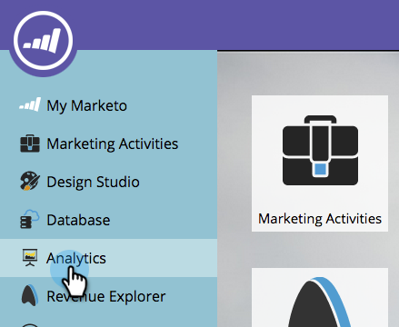
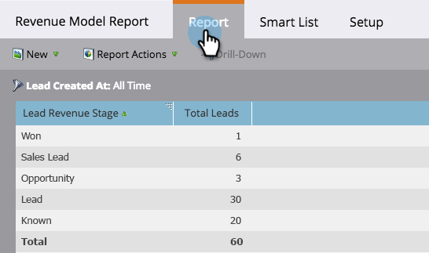

# 매출 모델 보고서 {#report-on-your-revenue-model}

각 수익 주기 모델에 대해 각 단계에 있는 잠재 고객 수에 대한 보고서를 생성할 수 있습니다.

>[!NOTE]
>
>리드는 보고서에 포함할 모델의 멤버여야 합니다.

1. **[!UICONTROL Analytics]** 으로 이동합니다.

   

1. **[!UICONTROL Leads by Revenue Stage]**&#x200B;를 클릭합니다.

   

1. **[!UICONTROL Setup]** 탭을 클릭한 다음 필터 섹션 아래에서 **[!UICONTROL Revenue Cycle Model]**&#x200B;을(를) 두 번 클릭합니다.

   

1. 승인된 **[!UICONTROL Model]**&#x200B;을(를) 선택하십시오.

   

   >[!NOTE]
   >
   >이 드롭다운 메뉴에서 사용할 수 있으려면 모델이 승인되거나 적어도 승인된 단계가 있어야 합니다.

1. 수익 주기 모델의 각 단계에 있는 잠재 고객 수를 확인하려면 **[!UICONTROL Report]** 탭을 클릭하십시오.

   

이것이 유용한 이유는 무엇입니까? 이 모델은 판매 및 마케팅 funnel을 보여 줍니다. 문제가 되기 전에 병목 현상을 파악하기 위해 시간이 지남에 따라 잔고를 추적하십시오.
