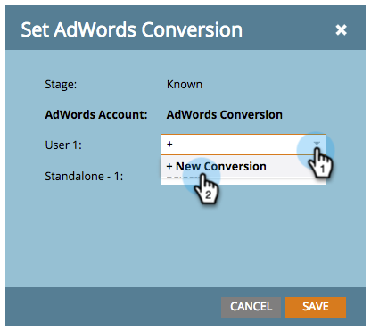
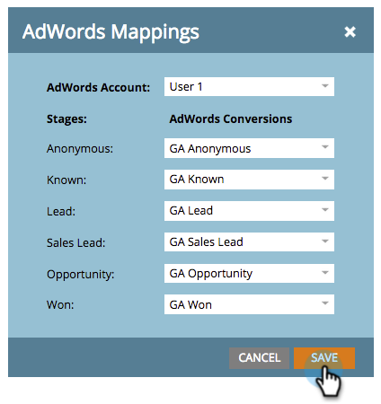

# 관리자 계정을 사용하여 수익 모델에서 [!DNL Google AdWords] 전환 설정 {#set-google-adwords-conversions-in-the-revenue-model-with-a-manager-account}

[!DNL Google AdWords] 계정을 Marketo에 연결하여 Marketo에서 [!DNL Google AdWords]&#x200B;(으)로 오프라인 전환 데이터를 자동으로 업로드합니다. [!DNL AdWords]에서 [사용자 지정 열을 추가](https://support.google.com/adwords/answer/3073556)한 후 [!DNL AdWords] UI에서 자격 있는 리드, 기회 및 신규 고객(또는 추적하려는 매출 단계)을 일으킨 클릭 수를 쉽게 확인할 수 있습니다.

[!DNL Google Adwords] 계정이 여러 개 있는 경우 [[!DNL Google AdWords] 관리자 계정](https://www.google.com/adwords/manager-accounts/)&#x200B;(이전의 내 클라이언트 센터)을 사용하여 이를 Marketo과 통합할 수 있습니다.

[!DNL AdWords] 오프라인 전환을 수익 모델의 하나 이상의 단계에 매핑할 수 있습니다. 두 가지 방법이 있습니다.

* 스테이지 작업
* [!DNL AdWords] 매핑

>[!PREREQUISITES]
>
>[관리자 계정을 사용하여  [!DNL Google AdWords] Launchpoint Service로 추가](/help/marketo/product-docs/administration/additional-integrations/add-google-adwords-as-a-launchpoint-service-with-a-manager-account.md)

## 스테이지 작업 사용 {#use-stage-action}

단계 작업 아래의 [!DNL AdWords] 전환을 매핑합니다.

1. [!DNL AdWords] 전환에 매핑할 단계를 선택하십시오.

   

1. **[!UICONTROL Stage Actions]** 드롭다운 아래에서 **[!UICONTROL Set AdWords Conversion]**&#x200B;을(를) 선택합니다.

   

1. **[!DNL AdWords]전환**&#x200B;을 설정합니다.

   >[!NOTE]
   >
   >각 하위 계정에 대해 다른 [!DNL AdWords] 전환을 선택할 수 있습니다.

   

   팁: [!DNL AdWords]개의 전환이 없는 경우 **[!UICONTROL +New Conversion]**&#x200B;을(를) 클릭하여 만드십시오.

   

1. **[!UICONTROL Save]**&#x200B;를 클릭합니다.

   

1. 모든 [!DNL AdWords] 전환을 매출 단계로 매핑했으면 요약 페이지로 돌아갑니다. **[!UICONTROL Model Actions]**&#x200B;을(를) 선택하고 **[!UICONTROL Approve Stages]**&#x200B;을(를) 선택합니다.

   

## Pro 팁: 새 변환 추가 {#pro-tip-add-a-new-conversion}

프로 팁! Marketo에서 새 [!DNL AdWords] 오프라인 전환을 만들 수 있습니다.

>[!CAUTION]
>
>Marketo에서 만든 새 전환에는 &quot;최적화&quot; 설정이 활성화되어 있습니다. 즉, [!DNL AdWords] 입찰 전략이 해당 전환에 대한 입찰을 최적화할 수 있습니다. [!DNL AdWords] 계정에서 이 설정을 변경할 수 있습니다.

1. **[!UICONTROL Stage Actions]** 드롭다운 아래에서 **[!UICONTROL Set AdWords Conversion]**&#x200B;을(를) 선택합니다.

   

1. **[!UICONTROL New Conversion]**&#x200B;를 선택합니다.

   

1. **전환 이름**&#x200B;을 입력하십시오. **[!UICONTROL Save]**&#x200B;를 클릭합니다.

   

   훌륭합니다! 이 새 변환은 [!DNL AdWords] 계정에 표시됩니다.

## [!DNL AdWords] 매핑 사용 {#use-adwords-mapping}

[!DNL AdWords] 매핑을 사용하여 모든 모델 단계를 [!DNL AdWords] 전환과 한 곳에서 연결할 수 있습니다.

1. **[!UICONTROL Edit AdWords Mappings]**&#x200B;를 선택합니다.

   

1. 추적할 각 단계에 대해 원하는 **[!DNL AdWords]계정** 및 원하는 **[!DNL AdWords]전환**&#x200B;을(를) 선택하십시오.

   

1. 단계를 매핑했으면 **[!UICONTROL Save]**&#x200B;을(를) 클릭합니다.

   

1. 모든 [!DNL AdWords] 전환을 매출 단계로 매핑했으면 요약 페이지로 돌아갑니다. **[!UICONTROL Model Actions]**&#x200B;을(를) 선택하고 **[!UICONTROL Approve Stages]**&#x200B;을(를) 선택합니다.

   

오프라인 전환 데이터를 보려면 [!DNL AdWords] 계정에 로그인해야 합니다. 해당 [사용자 지정 열 기능](https://support.google.com/adwords/answer/3073556)을 사용하여 Marketo에서 가져오는 각 오프라인 변환에 대한 변환 수 열을 만드는 것이 좋습니다.
