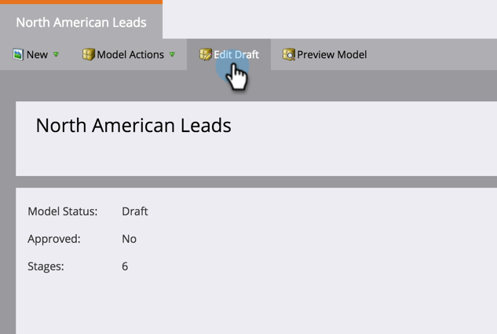
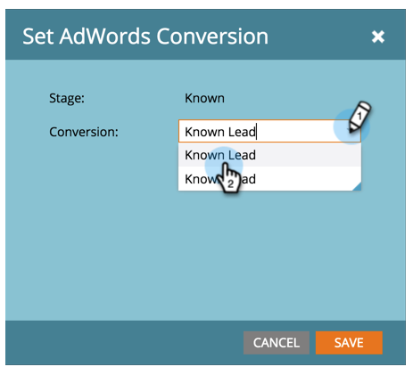

# 매출 모델에서 Google AdWords 전환 설정 {#set-google-adwords-conversions-in-the-revenue-model}

Google AdWords 계정을 Marketing에 연결하여 Marketing에서 Google AdWords로 오프라인 전환 데이터를 자동으로 업로드합니다. 그런 다음 AdWords에 사용자 지정 열을 [추가한 후 AdWords UI에서 자격 조건을 갖춘 리드, 기회 및 신규 고객(또는 추적하려는 모든 매출 단계)이 발생한 클릭 수를 손쉽게 확인할 수](https://support.google.com/adwords/answer/3073556) 있습니다.

>[!NOTE]
>
>Marketing에서 Google AdWords로 푸시된 통합입니다. 전환 데이터는 Google AdWords *포털에만* 나타나고** Marketing To UI에는 표시되지 않습니다. **

Google의 [오프라인 전환 가져오기 기능에 대한 자세한 내용을 살펴보십시오](https://support.google.com/adwords/answer/2998031?hl=en).  AdWords 오프라인 전환을 매출 모델에서 하나 이상의 단계에 매핑합니다. 세 가지 방법으로 매핑을 수행할 수 있습니다.

* AdWords 전환
* 스테이지 동작
* AdWords 매핑

단계 작업을 사용하는 경우 Marketing에서 새 AdWords 오프라인 전환을 만들 수 있습니다.

>[!NOTE]
>
>**사전 요구 사항**
>
>* [Google AdWords를 LaunchPoint 서비스로 추가](../../../../product-docs/administration/additional-integrations/add-google-adwords-as-a-launchpoint-service.md)

>

## AdWords 전환 사용 {#use-adwords-conversion}

1. 분석 **영역으로** 이동합니다.

   

1. 모델을 선택합니다.

   

1. 초안 **편집을 클릭합니다**.

   

1. AdWords 전환에 매핑할 매출 단계를 선택합니다.

   

1. Marketing **To** 스테이지에 매핑할 AdWords 전환을 선택합니다.

   

   좋아! AdWords 전환 데이터는 선택한 케이드의 Google AdWords에 업로드됩니다.

## 스테이지 동작 사용 {#use-stage-action}

단계 작업 아래에서 AdWords 전환을 매핑할 수도 있습니다.

1. AdWords 전환에 매핑할 단계를 선택합니다.

   

1. 단계 작업 **드롭다운** 아래에서 **AdWords 변환**&#x200B;설정을 선택합니다.

   

1. AdWords **변환을 선택합니다**.

   

   **팁**:AdWords 전환이 없는 경우 **+새 전환을 클릭하여 AdWords 전환을 만듭니다**.

   

1. 저장을 **클릭합니다**.

   

1. 모든 AdWords 전환을 매출 단계에 매핑한 후 요약 페이지로 돌아갑니다. 모델 작업 **을** 선택하고 단계 **승인을 선택합니다**.

   

## 전문가 팁:새 전환 추가 {#pro-tip-add-a-new-conversion}

팁! Marketing To에서 새 AdWords 오프라인 변환을 만들 수 있습니다.

>[!CAUTION]
>
>Marketing에서 만든 새 전환에는 &quot;최적화&quot; 설정이 활성화되어 있습니다. 즉, AdWords 입찰 전략은 이러한 전환에 대한 입찰을 최적화할 수 있습니다. AdWords 계정에서 이 설정을 변경할 수 있습니다.

1. 단계 작업 **드롭다운** 아래에서 **AdWords 변환**&#x200B;설정을 선택합니다.

   

1. 새 **전환을 선택합니다**.

   

1. 전환 **이름을 입력합니다**. 저장을 **클릭합니다**.

   

   훌륭해! 이 새 전환은 AdWords 계정에 나타납니다.

## AdWords 매핑 사용 {#use-adwords-mapping}

AdWords 매핑을 사용하여 모든 모델 단계를 AdWords 전환과 연결할 수 있습니다.

1. 광고 **단어 매핑 편집을 선택합니다**.

   

1. 추적할 각 단계에 대해 원하는 **AdWords** 변환을 선택합니다.

   

1. 스테이지를 매핑한 후 저장을 **클릭합니다**.

   

1. 모든 AdWords 전환을 매출 단계에 매핑한 후 요약 페이지로 돌아갑니다. 모델 작업 **을** 선택하고 단계 **승인을 선택합니다**.

   

오프라인 전환 데이터를 보려면 AdWords 계정에 로그인해야 합니다. Marketing To에서 가져오는 각 오프라인 변환에 [대해 사용자 지정 열 기능을](https://support.google.com/adwords/answer/3073556) 사용하여 전환 수 열을 만드는 것이 좋습니다.
