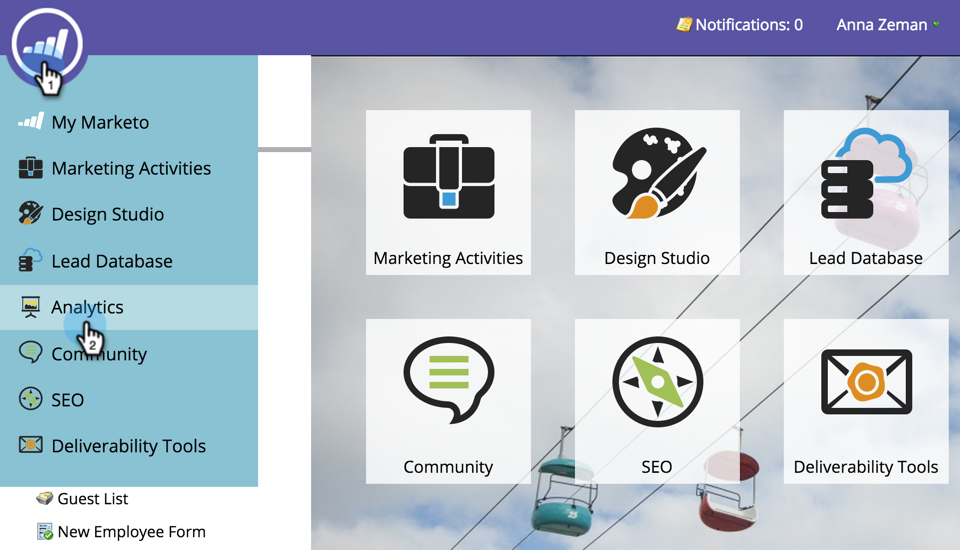

# 매출 모델에서 Google AdWords 전환 설정 {#set-google-adwords-conversions-in-the-revenue-model}

Google AdWords 계정을 Marketo에 연결하여 Marketo에서 Google AdWords로 오프라인 전환 데이터를 자동으로 업로드합니다. 그런 다음 AdWords UI에서 자격 조건을 갖춘 리드, 기회 및 신규 고객(또는 추적하려는 모든 수익 단계)이 발생한 클릭을 손쉽게 확인할 수 있습니다 [사용자 지정 열 추가](https://support.google.com/adwords/answer/3073556) 참조하십시오.

>[!NOTE]
>
>Marketo에서 Google AdWords로의 푸시 통합입니다. 전환 데이터가 표시됩니다 _전용_ Google AdWords 포털에서 _Marketo UI에 없음_.

추가 정보 [Google의 오프라인 전환 가져오기 기능](https://support.google.com/adwords/answer/2998031?hl=en). AdWords 오프라인 전환을 매출 모델의 하나 이상의 단계에 매핑합니다. 매핑을 수행하는 방법에는 세 가지가 있습니다.

* AdWords 전환
* 단계 작업
* AdWords 매핑

스테이지 작업을 사용하는 경우 Marketo에서 새 AdWords 오프라인 전환을 생성할 수 있습니다.

>[!PREREQUISITES]
>
>[Google AdWords as a LaunchPoint Service 추가](/help/marketo/product-docs/administration/additional-integrations/add-google-adwords-as-a-launchpoint-service.md)

## AdWords 전환 사용 {#use-adwords-conversion}

1. 로 이동합니다. **Analytics** 영역.

   

1. 모델을 선택합니다.

   

1. 클릭 **초안 편집**.

   

1. AdWords 전환에 매핑할 수입 단계를 선택합니다.

   

1. 을(를) 선택합니다 **AdWords 전환** Marketo 스테이지에 매핑하고 싶습니다.

   

   좋아! AdWords 전환 데이터는 선택한 케이지에서 Google AdWords에 업로드됩니다.

## 단계 작업 사용 {#use-stage-action}

스테이지 작업에서 AdWords 전환을 매핑할 수도 있습니다.

1. AdWords 변환에 매핑할 단계를 선택합니다.

   

1. 아래에 **단계 작업** 드롭다운, 선택 **AdWords 전환 설정**.

   

1. 선택 **AdWords 전환**.

   

   **팁**: AdWords 전환이 없는 경우 **+새 전환**.

   

1. 클릭 **저장**.

   

1. 모든 AdWords 전환을 수익 단계에 매핑한 후 요약 페이지로 돌아갑니다. 선택 **모델 작업** 및 **단계 승인**.

   

## Pro 팁: 새 전환 추가 {#pro-tip-add-a-new-conversion}

프로 팁! Marketo에서 새 AdWords 오프라인 전환을 만들 수 있습니다.

>[!CAUTION]
>
>Marketo에서 만든 새로운 전환에는 &quot;최적화&quot; 설정이 활성화되어 있습니다. 즉, AdWords 입찰 전략에서 그러한 전환에 대한 입찰을 최적화할 수 있습니다. AdWords 계정에서 이 설정을 변경할 수 있습니다.

1. 아래에 **단계 작업** 드롭다운, 선택 **AdWords 전환 설정**.

   

1. 선택 **새 전환**.

   

1. 을(를) 입력합니다. **변환 이름**. 클릭 **저장**.

   

   훌륭해요! 이 새 전환이 AdWords 계정에 나타납니다.

## AdWords 매핑 사용 {#use-adwords-mapping}

AdWords 매핑을 사용하여 한 위치에서 모든 모델 단계를 AdWords 변환과 연결할 수 있습니다.

1. 선택 **AdWords 매핑 편집**.

   

1. 원하는 을 선택합니다 **AdWords 전환** 추적할 각 단계에 대해 설명합니다.

   

1. 단계를 매핑했으면 을 클릭합니다 **저장**.

   

1. 모든 AdWords 전환을 수익 단계에 매핑한 후 요약 페이지로 돌아갑니다. 선택 **모델 작업** 및 **단계 승인**.

   

오프라인 전환 데이터를 보려면 AdWords 계정에 로그인해야 합니다. 이 매개 변수를 사용하는 것이 좋습니다 [사용자 정의 열 기능](https://support.google.com/adwords/answer/3073556) Marketo에서 가져오는 각 오프라인 변환에 대한 전환 카운트 열을 만들려면
