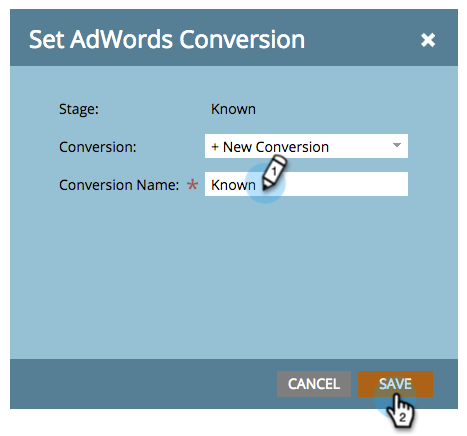

# 매출 모델 {#set-google-adwords-conversions-in-the-revenue-model}에서 Google AdWords 전환 설정

Google AdWords 계정을 Marketing에 연결하여 Marketing에서 Google AdWords로 오프라인 전환 데이터를 자동으로 업로드합니다. 그런 다음 AdWords에 [사용자 지정 열](https://support.google.com/adwords/answer/3073556)을 추가한 후 AdWords UI에서 자격이 있는 리드, 기회 및 신규 고객(또는 추적하고자 하는 모든 매출 단계)이 발생한 클릭을 쉽게 확인할 수 있습니다.

>[!NOTE]
>
>Marketing에서 Google AdWords로 푸시 통합입니다. 전환 데이터는 Google AdWords 포털에서 *만*&#x200B;로 표시되고 Marketing To UI에는 표시되지 않습니다**. **

[Google의 오프라인 변환 가져오기 기능에 대해 자세히 알아보십시오](https://support.google.com/adwords/answer/2998031?hl=en).  AdWords 오프라인 전환을 매출 모델에서 하나 이상의 단계에 매핑합니다. 매핑을 수행하는 방법에는 3가지가 있습니다.

* AdWords 전환
* 스테이지 동작
* AdWords 매핑

스테이지 동작을 사용하는 경우 Marketing에서 AdWords 오프라인 전환을 새로 만들 수 있습니다.

>[!PREREQUISITES]
>
>* [Google AdWords를 LaunchPoint 서비스로 추가](../../../../product-docs/administration/additional-integrations/add-google-adwords-as-a-launchpoint-service.md)

>

## AdWords 전환 사용 {#use-adwords-conversion}

1. **분석** 영역으로 이동합니다.

   

1. 모델을 선택합니다.

   

1. **초안 편집**&#x200B;을 클릭합니다.

   

1. AdWords 전환에 매핑할 매출 단계를 선택합니다.

   

1. 마케팅 스테이지에 매핑할 **AdWords 전환**&#x200B;을 선택합니다.

   

   좋아! AdWords 전환 데이터는 선택한 케이스의 Google AdWords에 업로드됩니다.

## 스테이지 작업 사용 {#use-stage-action}

단계 작업 아래에서 AdWords 전환을 매핑할 수도 있습니다.

1. AdWords 전환에 매핑할 단계를 선택합니다.

   

1. **스테이지 액션** 드롭다운에서 **AdWords 전환 설정**&#x200B;을 선택합니다.

   

1. **AdWords 전환**&#x200B;을 선택합니다.

   

   **팁**:AdWords 전환이 없는 경우  **+새 전환을 클릭하여 AdWords 전환을 만듭니다**.

   

1. **저장**&#x200B;을 클릭합니다.

   

1. 모든 AdWords 전환을 매출 단계에 매핑한 후 요약 페이지로 돌아갑니다. **모델 작업**&#x200B;을 선택하고 **단계 승인**&#x200B;을 선택합니다.

   

## 전문가 팁:새 전환 추가 {#pro-tip-add-a-new-conversion}

팁! Marketing To에서 새 AdWords 오프라인 전환을 만들 수 있습니다.

>[!CAUTION]
>
>Marketing에서 만든 새 전환에는 &quot;최적화&quot; 설정이 활성화되어 있습니다. 즉, AdWords 입찰 전략을 통해 이러한 전환에 대한 입찰을 최적화할 수 있습니다. AdWords 계정에서 이 설정을 변경할 수 있습니다.

1. **스테이지 액션** 드롭다운에서 **AdWords 전환 설정**&#x200B;을 선택합니다.

   

1. **새 전환**&#x200B;을 선택합니다.

   

1. **전환 이름**&#x200B;을 입력합니다. **저장**&#x200B;을 클릭합니다.

   

   훌륭해! 이 새 전환은 AdWords 계정에 표시됩니다.

## AdWords 매핑 사용 {#use-adwords-mapping}

AdWords 매핑을 사용하여 모든 모델 단계를 AdWords 전환과 연결할 수 있습니다.

1. **Edit AdWords 매핑**&#x200B;을 선택합니다.

   

1. 추적할 각 스테이지에 대해 원하는 **AdWords 전환**&#x200B;을 선택합니다.

   

1. 스테이지를 매핑했으면 **저장**&#x200B;을 클릭합니다.

   

1. 모든 AdWords 전환을 매출 단계에 매핑한 후 요약 페이지로 돌아갑니다. **모델 작업**&#x200B;을 선택하고 **단계 승인**&#x200B;을 선택합니다.

   

오프라인 전환 데이터를 보려면 AdWords 계정에 로그인해야 합니다. Marketing에서 가져오는 각 오프라인 변환에 대해 [사용자 지정 열 기능](https://support.google.com/adwords/answer/3073556)을 사용하여 전환 수 열을 만드는 것이 좋습니다.
