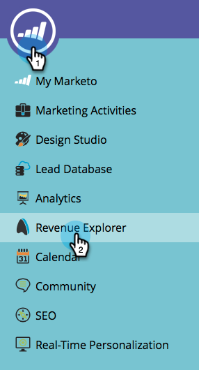

# 매출 모델러의 계정별 추적 시작 {#start-tracking-by-account-in-the-revenue-modeler}

매출 단계 모델러 및 매출 탐색기를 사용하면 모델을 통해 진행되는 동안 리드 및 계정의 성능에 대한 통찰력을 얻을 수 있습니다.

>[!NOTE]
>
>계정별 추적 **시작을 선택한 상태에서 승인된 모델의 성공 경로에 단계가 있는지 확인합니다**

1. 유용한 데이터를 수집하는 데 충분한 시간이 경과하면 **내 마케팅 홈** 아래에서 **매출 탐색기를**&#x200B;선택합니다.

   

1. 새 보고서를 만들려면 **파일** 을 클릭하고 새로 만들기 **를**&#x200B;선택한 다음&#x200B;**보고서**&#x200B;를선택합니다.

   

1. 분석 **영역으로 모델 성과 분석(회사)** 을 선택하고 확인을 **클릭합니다**.

   

1. 주별 **,**&#x200B;월 **및**&#x200B;종료 **잔액** 필드에 드래그하여 모델을 통해 회사의 진행 상황을 보여주는 것이 좋습니다. 필터를 사용하여 원하는 월을 선택합니다.

   

1. 보고서 설정이 완료되면, 회사 **를 마우스 오른쪽 단추로 클릭하고 필터** 를 **선택합니다**. 이것을 사용하여 계정별 **추적이 선택된 단계로만 보고서를** 제한합니다.

   

1. 대화 상자가 나타나면 예를 선택하고 가운데에 있는 오른쪽 화살표를 클릭합니다. 이렇게 하면 &quot;계정별 추적&quot;이 활성화된 단계만 필터링됩니다. 완료되면 **확인을** 클릭합니다.

   

1. 이제 보고서에 계정별로 추적 중인 단계만 표시됩니다. 나중에 사용할 수 있도록 보고서를 저장해야 합니다. 이제 이것을 마케팅 활동의 성공 측정으로 사용할 수 있습니다.

