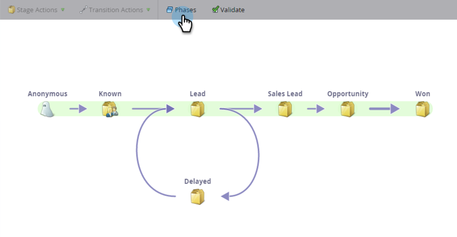

# 수익 모델 단계 이해 {#understanding-revenue-model-phases}

단계는 여러 단계를 그룹화하는 방법입니다. 모델의 여러 단계가 funnel의 한 단계를 반영하는 경우가 있습니다.

## 모델의 단계 정의 {#define-the-phases-of-the-model}

1. **[!UICONTROL Phases]**&#x200B;를 클릭합니다.

   

1. 파란색 단추를 클릭하여 단계를 위아래로 드래그합니다.

   
